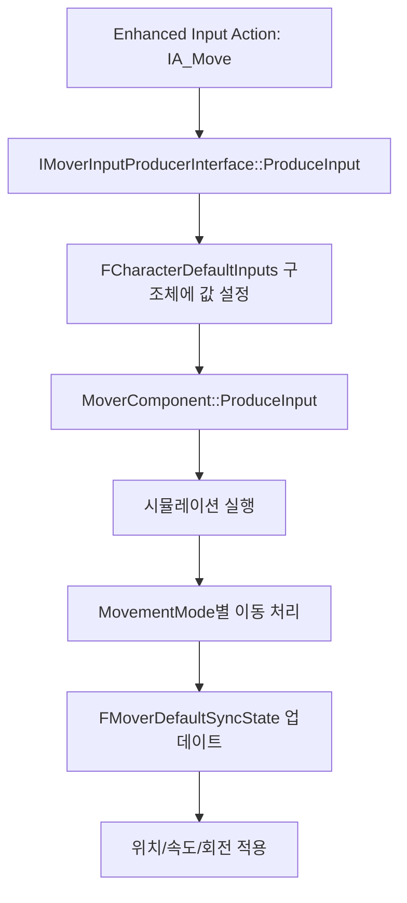

# SandboxCharacter_Mover 이동 로직 분석 보고서

## 📌 핵심 발견: Mover 플러그인 기반 시스템

`SandboxCharacter_Mover`는 **Unreal Engine의 실험적 Mover 플러그인**을 사용하는 캐릭터입니다.
기존 `CharacterMovementComponent(CMC)`가 아닌 **`MoverComponent`**를 사용합니다.

> [!IMPORTANT]
> Mover 플러그인은 `Engine/Plugins/Experimental/Mover`에 위치하며, 기존 CMC를 대체하는 차세대 이동 시스템입니다.

---

## 🔄 입력 처리 파이프라인



### 1. 입력 생성 (Input Production)
- **인터페이스**: `IMoverInputProducerInterface`
- **핵심 함수**: `ProduceInput_Implementation(int32 DeltaTimeMS, FMoverInputCmdContext& InputCmd)`
- BP에서 이 인터페이스를 구현하여 `FCharacterDefaultInputs`에 값을 채워 넣음

### 2. 입력 구조체: `FCharacterDefaultInputs`

| 필드 | 타입 | 설명 |
|------|------|------|
| `MoveInput` | `FVector` | 이동 입력 벡터 (방향 또는 속도) |
| `MoveInputType` | `EMoveInputType` | `DirectionalIntent` 또는 `Velocity` |
| `OrientationIntent` | `FVector` | 캐릭터가 바라볼 방향 |
| `ControlRotation` | `FRotator` | 카메라 기준 회전 |
| `SuggestedMovementMode` | `FName` | 강제 전환할 MovementMode 이름 |
| `bIsJumpPressed` | `bool` | 점프 버튼 눌림 상태 |
| `bIsJumpJustPressed` | `bool` | 점프 버튼 방금 눌림 |

### 3. Blueprint에서 입력 설정

```cpp
// C++ (MoverDataModelBlueprintLibrary)
void SetDirectionalInput(FCharacterDefaultInputs& Inputs, const FVector& DirectionInput);
void SetVelocityInput(FCharacterDefaultInputs& Inputs, const FVector& VelocityInput);
```

BP에서는 `Set Directional Input` 또는 `Set Velocity Input` 노드를 사용하여 이동 입력을 설정합니다.

---

## 🎮 SandboxCharacter_Mover에서의 처리 흐름 (추정)

1. **`IA_Move` 이벤트 발생** (Enhanced Input)
2. BP 로직에서 **CVar(`DDCvar.StrafeStyle` 등)** 체크하여 이동 스타일 결정
3. `IMoverInputProducerInterface::ProduceInput` 구현부에서:
   - `FCharacterDefaultInputs` 구조체 인스턴스 접근
   - `SetDirectionalInput()` 또는 `SetVelocityInput()` 호출하여 이동 방향 설정
4. `MoverComponent`가 매 Tick마다 `ProduceInput` 호출 → 시뮬레이션 실행
5. 활성화된 **MovementMode**(예: `Walking`, `Falling`, `Flying`)가 실제 이동 계산
6. `FMoverDefaultSyncState`에 결과(위치, 속도, 회전) 저장

---

## 📁 관련 소스 파일 (UnrealEngine)

| 파일 | 역할 |
|------|------|
| [MoverComponent.h](file:///c:/wz/UnrealEngine/Engine/Plugins/Experimental/Mover/Source/Mover/Public/MoverComponent.h) | 핵심 컴포넌트 (55KB) |
| [MoverDataModelTypes.h](file:///c:/wz/UnrealEngine/Engine/Plugins/Experimental/Mover/Source/Mover/Public/MoverDataModelTypes.h) | `FCharacterDefaultInputs`, `FMoverDefaultSyncState` 정의 |
| [MoverSimulationTypes.h](file:///c:/wz/UnrealEngine/Engine/Plugins/Experimental/Mover/Source/Mover/Public/MoverSimulationTypes.h) | `IMoverInputProducerInterface` 정의 |
| [SimpleWalkingMode.cpp](file:///c:/wz/UnrealEngine/Engine/Plugins/Experimental/Mover/Source/Mover/Private/DefaultMovementSet/Modes/SimpleWalkingMode.cpp) | 걷기 모드 구현 |
| [CharacterMoverComponent.h](file:///c:/wz/UnrealEngine/Engine/Plugins/Experimental/Mover/Source/Mover/Public/DefaultMovementSet/CharacterMoverComponent.h) | 캐릭터용 Mover 컴포넌트 |

---

## 🚀 러너 게임 적용 방안

### 방법 1: `IMoverInputProducerInterface` 구현 (권장)
`ExRunnerMovementComponent`가 이 인터페이스를 구현하여, 강제로 전진 입력을 생성:

```cpp
// ExRunnerMovementComponent.h
UCLASS()
class UExRunnerMovementComponent : public UActorComponent, public IMoverInputProducerInterface
{
    // ProduceInput_Implementation 구현
    virtual void ProduceInput_Implementation(int32 DeltaTimeMS, FMoverInputCmdContext& InputCmd) override;
};

// ExRunnerMovementComponent.cpp
void UExRunnerMovementComponent::ProduceInput_Implementation(int32 DeltaTimeMS, FMoverInputCmdContext& InputCmd)
{
    // 항상 전진 입력 강제 주입
    FCharacterDefaultInputs* Inputs = InputCmd.InputCollection.FindMutableDataByType<FCharacterDefaultInputs>();
    if (Inputs)
    {
        Inputs->SetMoveInput(EMoveInputType::DirectionalIntent, FVector(1.0f, 0.0f, 0.0f)); // 전진
    }
}
```

### 방법 2: `SuggestedMovementMode` 사용
특정 러너 전용 MovementMode를 만들어 강제 적용:
```cpp
Inputs->SuggestedMovementMode = FName("AutoRunning");
```

### 방법 3: `SetVelocityInput` 직접 호출
BP에서 매 프레임 `Set Velocity Input`으로 속도 직접 지정:
```
SetVelocityInput(Inputs, FVector(600, 0, 0))
```

---

## ❓ 추가 조사 필요 항목

1. `SandboxCharacter_Mover` BP 내 `ProduceInput` 이벤트 구현부 확인
2. `DDCvar.StrafeStyle` CVar가 정의된 위치 및 역할
3. 활성화된 MovementMode들 (`Walking`, `Running` 등) 확인
4. Motion Matching 연동 시 `FMoverDefaultSyncState.Velocity` 활용 방법

---

## 🔬 SandboxCharacter_Mover 실제 분석 결과

> **분석 방법**: Python Bridge(MCP)를 통해 BP 인스턴스를 에디터에 스폰하고 런타임 컴포넌트 구조를 조사

### 컴포넌트 목록
| 컴포넌트 클래스 | 이름 |
|---------------|------|
| CapsuleComponent | Capsule |
| SkeletalMeshComponent | SkeletalMesh |
| **ChildActorComponent** | **VisualOverride** |
| GameplayCameraComponent | GameplayCamera |
| SpringArmComponent | SpringArm |
| CameraComponent | Camera |
| **CharacterMoverComponent** | **CharacterMover** |
| AC_TraversalLogic_C | AC_TraversalLogic |
| MotionWarpingComponent | MotionWarping |
| AC_FoleyEvents_C | AC_FoleyEvents |
| **AC_VisualOverrideManager_C** | **AC_VisualOverrideManager** |
| NavMoverComponent | NavMover |

### CharacterMoverComponent 설정
```
input_producer = None
gather_input_from_all_input_producer_components = True
starting_movement_mode = Falling

movement_modes = {
  "Walking": BP_MovementMode_Walking,
  "Falling": BP_MovementMode_Falling,
  "Flying":  FlyingMode (C++),
  "Sliding": BP_MovementMode_Slide
}
```

### 핵심 발견
1. **`input_producer = None`**: 별도의 InputProducer 객체가 지정되지 않음
2. **`gather_input_from_all_input_producer_components = True`**: **Owner Actor의 모든 컴포넌트 중 `IMoverInputProducerInterface`를 구현한 것들이 자동으로 InputProducer로 등록됨**
3. **VisualOverride는 `ChildActorComponent`**: 우리의 `ExRunnerMovementComponent`를 여기에 추가해야 함

### 입력 생성 위치 추정
BP 자체 또는 그 컴포넌트 중 하나가 `IMoverInputProducerInterface`를 구현:
- 가능성 1: BP 이벤트 그래프에서 직접 `ProduceInput` 구현
- 가능성 2: Custom 컴포넌트(예: `AC_TraversalLogic_C`)가 인터페이스 구현

> [!TIP]
> **러너 로직 적용 방법**: `ExRunnerMovementComponent`가 `IMoverInputProducerInterface`를 구현하면, `CharacterMoverComponent`가 자동으로 감지하여 입력을 수집함.

---

## 📖 MoverExamplesCharacter 구현 패턴

MoverExamples 플러그인의 예제 캐릭터 분석 결과:

```cpp
// MoverExamplesCharacter.h
UCLASS(Abstract)
class AMoverExamplesCharacter : public APawn, public IMoverInputProducerInterface
{
    // 핵심 함수
    virtual void ProduceInput_Implementation(int32 SimTimeMs, FMoverInputCmdContext& InputCmdResult) override;
    
    // 네이티브 확장 포인트
    virtual void OnProduceInput(float DeltaMs, FMoverInputCmdContext& InputCmdResult);
    
    // BP 확장 포인트
    UFUNCTION(BlueprintImplementableEvent, DisplayName="On Produce Input")
    FMoverInputCmdContext OnProduceInputInBlueprint(float DeltaMs, FMoverInputCmdContext InputCmd);
};
```

### 구현 흐름
1. **`ProduceInput_Implementation`**: Mover 시스템이 호출하는 진입점
2. **`OnProduceInput`**: C++ 네이티브 확장 포인트
3. **`OnProduceInputInBlueprint`**: BP에서 오버라이드 가능한 이벤트

---

## ✅ 러너 게임 적용 결론

### 권장 방법: `ExRunnerMovementComponent`에 `IMoverInputProducerInterface` 구현

```cpp
// ExRunnerMovementComponent.h
#include "MoverSimulationTypes.h"

UCLASS()
class UExRunnerMovementComponent : public UActorComponent, public IMoverInputProducerInterface
{
    GENERATED_BODY()
    
    virtual void ProduceInput_Implementation(int32 SimTimeMs, FMoverInputCmdContext& InputCmdResult) override;
};

// ExRunnerMovementComponent.cpp
void UExRunnerMovementComponent::ProduceInput_Implementation(int32 SimTimeMs, FMoverInputCmdContext& InputCmdResult)
{
    FCharacterDefaultInputs* Inputs = InputCmdResult.InputCollection.FindMutableDataByType<FCharacterDefaultInputs>();
    if (Inputs)
    {
        // 항상 전진 (러너 게임)
        FVector ForwardIntent = GetOwner()->GetActorForwardVector();
        Inputs->SetMoveInput(EMoveInputType::DirectionalIntent, ForwardIntent);
    }
}
```

### 장점
- `CharacterMoverComponent`가 **자동으로 감지**하여 입력 수집
- **기존 BP 수정 최소화** - 컴포넌트 추가만으로 동작
- **Velocity가 정상적으로 업데이트** → 애니메이션 자동 연동

> **구현 메모 (2026-06-22):** 현재 `ExRunnerMovementComponent`는 위 권장안에 따라 입력을 주입하되, 실제 코드에서는 `UMoverDataModelBlueprintLibrary::SetDirectionalInput()`을 사용한다 (`ExRunnerMovementComponent.cpp` 참조). 구 `SetVelocityInput` 방식은 더 이상 사용하지 않는다.

---

## 📚 부록: MovementModes 구조 및 상태 전환

> 구 `Guides/Common/Mover_MovementModes_Analysis.md` 내용을 본 문서로 통합 (2026-06-22).

### A. MovementModes의 실제 구조
- **오해**: 에디터 디테일 패널에서 마치 블루프린트 커스텀 구조체나 배열처럼 보여 BP 전용 데이터로 오해하기 쉽다.
- **실제 (C++)**: `UMoverComponent` 내부에 정의된 `TMap<FName, TObjectPtr<UBaseMovementMode>>` 프로퍼티다. 상태 이름(FName)을 키로, 이동 모드 C++ 인스턴스(Instanced Object)를 값으로 가지는 데이터 사전(Map)이다.

### B. 이동 속도 제어 구조 (MaxSpeed 등)
- **데이터 위치**: 속도 데이터는 구조체를 직접 Break하지 않는다. "Walking" 같은 각 모드 내부에 할당된 **`Shared Settings`(공유 세팅 객체)** 안에 존재한다.
    - 예) `Walking` → `Shared Settings` → `CommonLegacyMovementSettings` → `MaxSpeed`
- **접근 및 수정 방법**:
    - **BP**: `CharacterMover` 객체에서 **`Find Shared Settings`** 노드로 `CommonLegacyMovementSettings` 객체를 얻어 값을 읽거나 쓴다.
    - **C++**: `MoverComp->FindSharedSettings<UCommonLegacyMovementSettings>()`로 포인터를 얻어 수정한다.

### C. 상태 치환(Walking ↔ Falling 등)의 발생 위치
Mover는 분기(Branch)문이 아니라 상태 머신에 의해 그룹 전환을 관리한다. 크게 3곳에서 처리된다.
1. **엔진 내부 자동 전환 (내장 C++ 로직)**: `UWalkingMode::OnGenerateMove` 등에서 바닥(Floor) 검사를 수행하고, 바닥이 없어지면 엔진이 스스로 `"Falling"` 모드로 `QueueNextMode`한다.
2. **데이터 기반 전환 (Transitions 배열)**: `CharacterMover`의 하단 `Transitions` 에디터 배열에 룰을 추가하여, 조건(입력, 속도 등) 만족 시 다른 모드로 넘어가도록 비주얼 설정이 가능하다.
3. **명시적 코드/블루프린트 강제 전환**:
    - **BP**: `Queue Next Mode` 노드에 상태 이름 입력.
    - **C++**: `MoverComp->QueueNextMode(FName("Walking"));`

> 참고: 속도 제어를 억지로 덮어쓰거나 Tick에서 강제 전환하지 말고, Mover의 의도된 흐름(Shared Settings 조회 및 Queue Next Mode)을 활용하는 것이 안정적이다.


