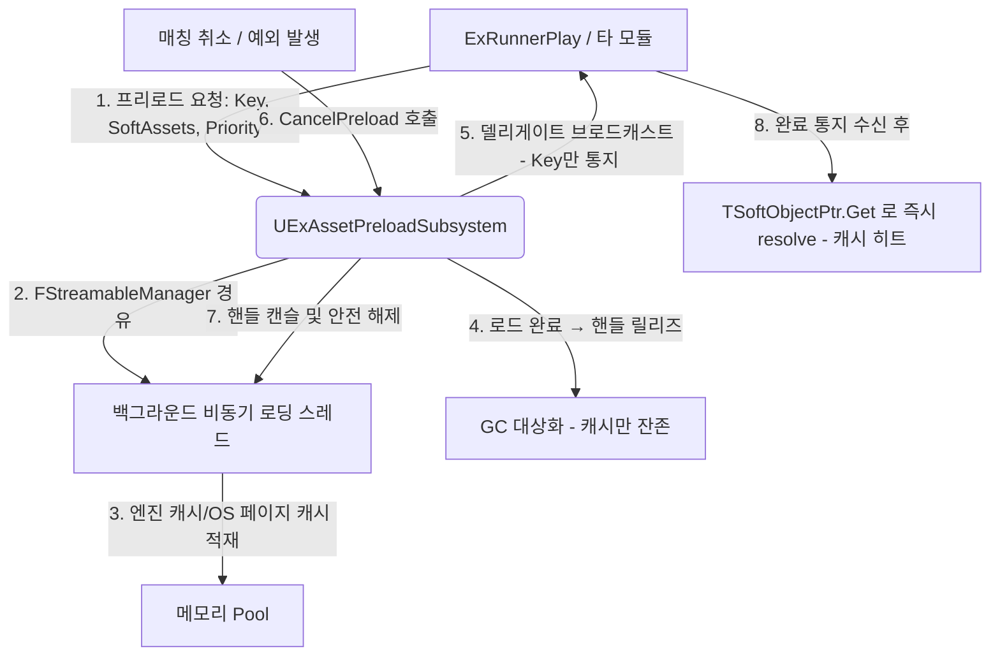

# ExCore 범용 백그라운드 에셋 프리로드 시스템 설계 계획서 (ExCore Asset Preload System Plan)

> **엔진**: Unreal Engine 5.7.3  
> **위상**: ExCore (범용 핵심 프레임워크)  
> **작성**: 안티그래비티 (Antigravity)  
> **수신**: 주인님 (Master)  
> **버전**: v3.1 (2026-05-19)

---

## 변경 이력 (Change History)

| 버전 | 날짜 | 변경 내용 |
|------|------|-----------|
| v1 | 2026-05-19 | 초안. `bKeepReference` 이중 모드 설계. |
| v2 | 2026-05-19 | `bKeepReference` 전면 삭제 → Fire-and-Forget 전환 (SRP). 구조체 선언 수정, `LogExPreload` 도입, `ensure()` 추가, Progress/Debug API 추가, `Deinitialize` Swap 패턴, 컨벤션 정비. |
| v3 | 2026-05-19 | `FStreamableManager` 멤버 → `UAssetManager::GetStreamableManager()` 싱글톤. 실패 처리(`OnPreloadFailed`, `FailedContexts`). `ClearPreloadResult` API. `GetPreloadProgress` 미등록 Key → `-1.0f`. `TSet` 중복 제거. |
| v3.1 | 2026-05-19 | Cancel 후 spurious 실패 통지 방지 (early-out 추가). `Deinitialize`에 `FailedContexts.Empty()` 누락 수정. `ClearCompletedContext` → `ClearPreloadResult` 리네임. 부분 실패 미감지 제약사항 문서화. |

---

## 1. 개요 및 배경

안드로이드 모바일 기기 및 Windows 독립 빌드(Stand-alone Packaging) 환경에서는 메모리 파편화 및 실시간 에셋 컴파일(Derived Data Cache 및 셰이더 컴파일)로 인해 최초 특정 콘텐츠(포즈 검색 데이터베이스 `PSD_`, 중형 캐릭터 스켈레탈 메시 등)를 로드할 때 극심한 메인 스레드 병목과 프레임 드랍이 수초에서 수십 초간 발생한다.

이 병목을 해소하기 위해 **"매칭 대기 시간" 및 "로비 유휴 시간"**을 활용하여 다음 인게임 콘텐츠를 백그라운드에서 비동기 로드해 적재하는 시스템을 구현하되, 특정 모듈에 종속되지 않고 **ExCore 위상의 완전한 공통 범용 시스템**으로 설계한다.

---

## 2. 핵심 설계 원칙



### ① ExCore 위상의 공통 범용 구조 (Multi-Module Usability)
* **문제점**: 특정 피처 모듈의 C++ 자료형을 직접 참조할 경우 의존성 순환(Dependency Loop) 또는 아키텍처 규칙이 파괴된다.
* **해결책**:
  * `ExCore`에 **`UExAssetPreloadSubsystem` (GameInstanceSubsystem 파생)**을 선언한다.
  * API는 오직 **`TSoftObjectPtr<UObject>`의 배열** 또는 **`FSoftObjectPath` 배열**, 그리고 **`Key (FName)`**만을 매개변수로 수신한다.
  * 이를 통해 러너, 배틀로얄, 로비 UI, 캐릭터 커스터마이징 등 모든 독립 모듈 및 GameFeature에서 각자의 프리로드 대상 에셋을 이 서브시스템으로 안전하고 자유롭게 넘겨 백그라운드 로드를 발주할 수 있다.

### ② Fire-and-Forget 캐시 워밍 (Zero-Ownership Preload)
* **핵심 원칙**: 서브시스템은 에셋을 **소유하지 않는다**. 비동기 로드 완료 후 스트리밍 핸들을 릴리즈하여 에셋이 엔진/OS 캐시에만 잔존하도록 한다.
* **소비 모듈의 책임**: 완료 델리게이트 수신 후, 이미 보유하고 있는 `TSoftObjectPtr`를 `.Get()` 또는 `.LoadSynchronous()`로 resolve하면 캐시 히트로 즉시 반환된다.
* **맵 트래블 시 주의**: `CollectGarbage()`가 강제 호출되므로 캐시가 소실될 수 있다. 맵 트래블을 거치는 시나리오(로비→인게임)에서 에셋 보존이 필요하면, **소비 모듈이 트래블 전에 자체적으로 강참조(`UPROPERTY` 등)를 확보해야 한다.** 이는 프리로드 서브시스템의 책임 범위가 아니다.

### ③ 프로세스 최소 영향 & 예외 상황 안전 대응 (Low-Impact & Exception Safety)
* **문제점**: 백그라운드 로딩 작업이 메인 렌더링 스레드의 타임 슬라이스를 과도하게 점유하면 스터터링(Stuttering)이 유발되며, 비동기 로딩 중 사용자가 매칭을 취소하면 좀비 로딩이 남을 수 있다.
* **해결책**:
  * **비동기 우선순위 제어 (`LoadPriority`)**: 로딩 우선순위를 낮게 설정하여 로비 화면의 UI 렌더링이나 다른 프레임 연산에 끼치는 영향을 최소화한다.
  * **비동기 핸들 캔슬 안전장치 (`TSharedPtr<FStreamableHandle>`)**: 로딩 요청마다 고유한 스트리밍 핸들을 `TMap<FName, TSharedPtr<FStreamableHandle>> ActiveHandles`에 보관한다.
  * **예외 취소 연동**: 매칭 취소 또는 비정상 세션 끊김 시 `CancelPreload(Key)` → `Handle->CancelHandle()` 호출로 백그라운드 로딩을 즉시 중단한다.

---

## 3. 세부 클래스 및 API 설계 (C++)

### [NEW] `FExPreloadOptions` 구조체

> 파일 위치: `ExCoreRuntime/Struct/Subsystems/FExPreloadOptions.h` (CLAUDE.md §1.5 구조체 폴더 규칙 준수)

```cpp
// Copyright ExFrameWork. All Rights Reserved.
// 파일: FExPreloadOptions.h
// 목적: UExAssetPreloadSubsystem의 프리로드 요청 옵션 구조체
// 작성: Antigravity
// 생성일: 2026-05-19

#pragma once

#include "CoreMinimal.h"
#include "FExPreloadOptions.generated.h"

/**
 * FExPreloadOptions
 * 비동기 프리로드 요청 시 전달하는 옵션 구조체.
 * 로딩 우선순위 등 프리로드 동작을 제어한다.
 */
USTRUCT(BlueprintType)
struct EXCORERUNTIME_API FExPreloadOptions
{
	GENERATED_BODY()

	/** 로딩 스레드 우선순위 (0: 최하위 ~ 100: 최상위, 기본값 0) */
	UPROPERTY(EditAnywhere, BlueprintReadWrite, Category = "Preload")
	int32 LoadPriority = 0;
};
```

### [NEW] `UExAssetPreloadSubsystem`

> 파일 위치: `ExCoreRuntime/Subsystems/ExAssetPreloadSubsystem.h/.cpp`

#### A. 헤더 파일 (`ExAssetPreloadSubsystem.h`)
```cpp
// Copyright ExFrameWork. All Rights Reserved.
// 파일: ExAssetPreloadSubsystem.h
// 목적: ExCore 범용 비동기 에셋 사전 로딩(캐시 워밍) 서브시스템
// 작성: Antigravity
// 생성일: 2026-05-19

#pragma once

#include "CoreMinimal.h"
#include "Subsystems/GameInstanceSubsystem.h"
#include "Engine/StreamableManager.h"
#include "Engine/AssetManager.h"
#include "Struct/Subsystems/FExPreloadOptions.h"
#include "ExAssetPreloadSubsystem.generated.h"

DECLARE_LOG_CATEGORY_EXTERN(LogExPreload, Log, All);

/** 프리로드 완료 알림 델리게이트 (Key만 통지 — Fire-and-Forget 원칙) */
DECLARE_DYNAMIC_MULTICAST_DELEGATE_OneParam(FOnPreloadFinished, FName, ContextKey);

/** 프리로드 실패 알림 델리게이트 (Key + 실패 사유 통지) */
DECLARE_DYNAMIC_MULTICAST_DELEGATE_OneParam(FOnPreloadFailed, FName, ContextKey);

/**
 * UExAssetPreloadSubsystem
 *
 * ExCore에 속하는 범용 비동기 에셋 사전 로딩(캐시 워밍) 서브시스템.
 *
 * 핵심 원칙 (Fire-and-Forget):
 *   - 비동기 로드 완료 후 스트리밍 핸들을 즉시 릴리즈한다.
 *   - 에셋은 엔진/OS 캐시에만 잔존하며, 서브시스템은 에셋을 소유하지 않는다.
 *   - 완료 델리게이트로 Key만 통지하고, 에셋 수명 관리는 소비 모듈의 책임이다.
 *
 * 사용 예시:
 *   // 소비 모듈에서 프리로드 요청
 *   auto* Preloader = GetGameInstance()->GetSubsystem<UExAssetPreloadSubsystem>();
 *   Preloader->PreloadAssets(TEXT("RunnerMatch"), SoftAssetArray, FExPreloadOptions());
 *
 *   // 완료 통지 수신 후
 *   UObject* Loaded = MySoftPtr.Get();  // 캐시 히트로 즉시 반환
 */
UCLASS()
class EXCORERUNTIME_API UExAssetPreloadSubsystem : public UGameInstanceSubsystem
{
	GENERATED_BODY()

public:
	virtual void Initialize(FSubsystemCollectionBase& Collection) override;
	virtual void Deinitialize() override;

	// ─────────────────────────────────────────────
	//  Core API
	// ─────────────────────────────────────────────

	/**
	 * [범용 API] 특정 컨텍스트 키에 대해 지정된 소프트 에셋 목록을 백그라운드 비동기로 로드한다.
	 * 이미 완료된 키에 대한 재요청은 허용된다 (기존 상태를 초기화 후 새로 로드).
	 * 진행 중인 키에 대한 중복 요청은 거부된다.
	 */
	UFUNCTION(BlueprintCallable, Category = "ExPreload")
	void PreloadAssets(FName ContextKey, const TArray<TSoftObjectPtr<UObject>>& AssetsToLoad, FExPreloadOptions Options);

	/**
	 * [취소 및 해제 API] 진행 중인 비동기 로딩을 강제 캔슬한다.
	 * 핸들이 존재하면 CancelHandle()을 호출하여 백그라운드 스레드 작업을 즉시 중단한다.
	 */
	UFUNCTION(BlueprintCallable, Category = "ExPreload")
	void CancelPreload(FName ContextKey);

	/**
	 * [전체 취소 API] 모든 활성 프리로드를 일괄 캔슬한다.
	 */
	UFUNCTION(BlueprintCallable, Category = "ExPreload")
	void CancelAllPreloads();

	/**
	 * [체크 API] 특정 컨텍스트의 프리로드가 완료되었는지 여부를 반환한다.
	 */
	UFUNCTION(BlueprintPure, Category = "ExPreload")
	bool IsPreloadComplete(FName ContextKey) const;

	/**
	 * [진행률 API] 특정 컨텍스트의 로딩 진행률을 반환한다 (0.0 ~ 1.0).
	 * - 완료된 키: 1.0 반환
	 * - 진행 중인 키: 핸들의 실제 진행률 반환
	 * - **등록된 적 없는 키: -1.0 반환** (1.0과 구분되므로 소비 모듈은 < 0 체크로 미등록 여부 판별 가능)
	 */
	UFUNCTION(BlueprintPure, Category = "ExPreload")
	float GetPreloadProgress(FName ContextKey) const;

	/**
	 * [실패 여부 API] 특정 컨텍스트의 프리로드가 실패했는지 여부를 반환한다.
	 */
	UFUNCTION(BlueprintPure, Category = "ExPreload")
	bool IsPreloadFailed(FName ContextKey) const;

	/**
	 * [정리 API] 완료/실패 상태를 명시적으로 제거한다.
	 * 소비 모듈은 완료 통지를 처리한 뒤 이 함수를 호출하여 CompletedContexts/FailedContexts 누적을 방지해야 한다.
	 * (계약 원칙: 서브시스템이 자동 정리하지 않으므로, 소비 모듈의 명시적 호출 책임)
	 */
	UFUNCTION(BlueprintCallable, Category = "ExPreload")
	void ClearPreloadResult(FName ContextKey);

	// ─────────────────────────────────────────────
	//  Debug API
	// ─────────────────────────────────────────────

	/**
	 * [디버그] 현재 모든 프리로드 상태를 화면 및 로그에 덤프한다.
	 * Shipping 빌드에서는 동작하지 않는다.
	 */
	UFUNCTION(BlueprintCallable, Category = "ExPreload|Debug")
	void DebugDumpPreloadStatus() const;

public:
	/** 비동기 프리로드 완료 알림 델리게이트 (Key만 통지) */
	UPROPERTY(BlueprintAssignable, Category = "ExPreload")
	FOnPreloadFinished OnPreloadFinished;

	/** 비동기 프리로드 실패 알림 델리게이트 */
	UPROPERTY(BlueprintAssignable, Category = "ExPreload")
	FOnPreloadFailed OnPreloadFailed;

private:
	/** 비동기 로드 완료/실패 콜백 — 성공/실패를 구분하여 각 델리게이트를 브로드캐스트한다. */
	void HandleAsyncLoadComplete(FName ContextKey);

private:
	/** 컨텍스트별 현재 실행 중인 비동기 스트리밍 핸들 맵 */
	TMap<FName, TSharedPtr<FStreamableHandle>> ActiveHandles;

	/** 완료된 프리로드 상태 관리용 셋 (소비 모듈이 ClearPreloadResult로 명시 정리 필요) */
	TSet<FName> CompletedContexts;

	/** 실패한 프리로드 상태 관리용 셋 (소비 모듈이 ClearPreloadResult로 명시 정리 필요) */
	TSet<FName> FailedContexts;

#if !UE_BUILD_SHIPPING
	/** [디버그 전용] 컨텍스트별 요청 시각 (로딩 소요시간 측정용) */
	TMap<FName, double> DebugRequestTimestamps;

	/** [디버그 전용] 컨텍스트별 요청 에셋 수 */
	TMap<FName, int32> DebugAssetCounts;
#endif
};
```

#### B. 소스 파일 (`ExAssetPreloadSubsystem.cpp`)
```cpp
// Copyright ExFrameWork. All Rights Reserved.
// 파일: ExAssetPreloadSubsystem.cpp
// 목적: ExCore 범용 비동기 에셋 사전 로딩(캐시 워밍) 서브시스템 구현
// 작성: Antigravity
// 생성일: 2026-05-19

#include "ExAssetPreloadSubsystem.h"
#include "Engine/Engine.h"

DEFINE_LOG_CATEGORY(LogExPreload);

void UExAssetPreloadSubsystem::Initialize(FSubsystemCollectionBase& Collection)
{
	Super::Initialize(Collection);
	UE_LOG(LogExPreload, Log, TEXT("[ExAssetPreloadSubsystem] 범용 프리로드 서브시스템 초기화 완료."));
}

void UExAssetPreloadSubsystem::Deinitialize()
{
	// 안전한 순회: ActiveHandles를 Swap으로 복사 후 원본 비우기
	TMap<FName, TSharedPtr<FStreamableHandle>> HandlesToCancel;
	Swap(HandlesToCancel, ActiveHandles);

	for (auto& [Key, Handle] : HandlesToCancel)
	{
		if (Handle.IsValid() && Handle->IsActive())
		{
			Handle->CancelHandle();
			UE_LOG(LogExPreload, Log, TEXT("[ExAssetPreloadSubsystem] Deinitialize: '%s' 핸들 캔슬."), *Key.ToString());
		}
	}

	CompletedContexts.Empty();
	FailedContexts.Empty();

#if !UE_BUILD_SHIPPING
	DebugRequestTimestamps.Empty();
	DebugAssetCounts.Empty();
#endif

	Super::Deinitialize();
}

void UExAssetPreloadSubsystem::PreloadAssets(
	FName ContextKey,
	const TArray<TSoftObjectPtr<UObject>>& AssetsToLoad,
	FExPreloadOptions Options)
{
	// 필수 파라미터 검증 (CLAUDE.md §1.7 — ensure 사용)
	if (!ensureMsgf(!ContextKey.IsNone(), TEXT("[ExPreload] ContextKey가 None입니다. 프리로드를 등록할 수 없습니다.")))
	{
		return;
	}

	if (!ensureMsgf(AssetsToLoad.Num() > 0, TEXT("[ExPreload] '%s': AssetsToLoad가 비어있습니다."), *ContextKey.ToString()))
	{
		return;
	}

	// 이미 동일 키가 로딩 진행 중이면 거부
	if (ActiveHandles.Contains(ContextKey))
	{
		UE_LOG(LogExPreload, Warning,
			TEXT("[ExAssetPreloadSubsystem] '%s' 키에 대한 프리로드가 이미 실행 중입니다. 새 요청을 무시합니다."),
			*ContextKey.ToString());
		return;
	}

	// 이미 완료된 키에 대한 재요청은 허용 — 기존 상태 초기화 후 새로 로드
	CompletedContexts.Remove(ContextKey);
	FailedContexts.Remove(ContextKey);

	// Soft Pointer → FSoftObjectPath 변환 (TSet으로 O(1) 중복 제거)
	TSet<FSoftObjectPath> TargetSet;
	TargetSet.Reserve(AssetsToLoad.Num());
	for (const TSoftObjectPtr<UObject>& Asset : AssetsToLoad)
	{
		if (!Asset.IsNull())
		{
			TargetSet.Add(Asset.ToSoftObjectPath());
		}
	}

	if (TargetSet.Num() == 0)
	{
		UE_LOG(LogExPreload, Warning,
			TEXT("[ExAssetPreloadSubsystem] '%s': 유효한 에셋 경로가 없습니다. 모두 Null이었습니다."),
			*ContextKey.ToString());
		return;
	}

	TArray<FSoftObjectPath> Targets = TargetSet.Array();

	UE_LOG(LogExPreload, Log,
		TEXT("[ExAssetPreloadSubsystem] '%s' 백그라운드 프리로드 개시 (에셋 수: %d, 우선순위: %d)"),
		*ContextKey.ToString(), Targets.Num(), Options.LoadPriority);

#if !UE_BUILD_SHIPPING
	DebugRequestTimestamps.Add(ContextKey, FPlatformTime::Seconds());
	DebugAssetCounts.Add(ContextKey, Targets.Num());
#endif

	// 비동기 로드 요청 — UAssetManager 싱글톤 StreamableManager 사용 (UE5 표준)
	// 별도 FStreamableManager 인스턴스 생성 금지: 엔진 글로벌 로딩 큐와 캐시가 분리되어 중복 로딩/캐시 미스 발생 위험
	TSharedPtr<FStreamableHandle> NewHandle = UAssetManager::GetStreamableManager().RequestAsyncLoad(
		Targets,
		FStreamableDelegate::CreateUObject(this, &UExAssetPreloadSubsystem::HandleAsyncLoadComplete, ContextKey),
		Options.LoadPriority
	);

	if (NewHandle.IsValid())
	{
		ActiveHandles.Add(ContextKey, NewHandle);
	}
}

void UExAssetPreloadSubsystem::CancelPreload(FName ContextKey)
{
	if (TSharedPtr<FStreamableHandle>* HandlePtr = ActiveHandles.Find(ContextKey))
	{
		if (HandlePtr->IsValid() && (*HandlePtr)->IsActive())
		{
			(*HandlePtr)->CancelHandle();
			UE_LOG(LogExPreload, Log,
				TEXT("[ExAssetPreloadSubsystem] '%s' 진행 중이던 비동기 프리로드 핸들을 안전하게 취소했습니다."),
				*ContextKey.ToString());
		}
		ActiveHandles.Remove(ContextKey);
	}

	CompletedContexts.Remove(ContextKey);
	FailedContexts.Remove(ContextKey);

#if !UE_BUILD_SHIPPING
	DebugRequestTimestamps.Remove(ContextKey);
	DebugAssetCounts.Remove(ContextKey);
#endif
}

void UExAssetPreloadSubsystem::CancelAllPreloads()
{
	TMap<FName, TSharedPtr<FStreamableHandle>> HandlesToCancel;
	Swap(HandlesToCancel, ActiveHandles);

	for (auto& [Key, Handle] : HandlesToCancel)
	{
		if (Handle.IsValid() && Handle->IsActive())
		{
			Handle->CancelHandle();
			UE_LOG(LogExPreload, Log,
				TEXT("[ExAssetPreloadSubsystem] CancelAll: '%s' 핸들 캔슬."), *Key.ToString());
		}
	}

	CompletedContexts.Empty();
	FailedContexts.Empty();

#if !UE_BUILD_SHIPPING
	DebugRequestTimestamps.Empty();
	DebugAssetCounts.Empty();
#endif
}

bool UExAssetPreloadSubsystem::IsPreloadComplete(FName ContextKey) const
{
	return CompletedContexts.Contains(ContextKey);
}

bool UExAssetPreloadSubsystem::IsPreloadFailed(FName ContextKey) const
{
	return FailedContexts.Contains(ContextKey);
}

void UExAssetPreloadSubsystem::ClearPreloadResult(FName ContextKey)
{
	CompletedContexts.Remove(ContextKey);
	FailedContexts.Remove(ContextKey);

#if !UE_BUILD_SHIPPING
	DebugRequestTimestamps.Remove(ContextKey);
	DebugAssetCounts.Remove(ContextKey);
#endif
}

float UExAssetPreloadSubsystem::GetPreloadProgress(FName ContextKey) const
{
	if (CompletedContexts.Contains(ContextKey) || FailedContexts.Contains(ContextKey))
	{
		return 1.0f;
	}

	if (const TSharedPtr<FStreamableHandle>* HandlePtr = ActiveHandles.Find(ContextKey))
	{
		if (HandlePtr->IsValid())
		{
			return (*HandlePtr)->GetProgress();
		}
	}

	// 등록된 적 없는 키는 -1.0 반환 (1.0 "완료됨"과 명확히 구분)
	// 소비 모듈은 반환값 < 0 체크로 미등록 키 여부를 판별해야 한다.
	return -1.0f;
}

void UExAssetPreloadSubsystem::HandleAsyncLoadComplete(FName ContextKey)
{
	check(IsInGameThread());

	// 이미 취소된 컨텍스트는 무시 (CancelPreload에서 ActiveHandles 제거 완료)
	if (!ActiveHandles.Contains(ContextKey))
	{
		return;
	}

	// 핸들 참조 확보 후 ActiveHandles에서 제거 (Fire-and-Forget: 소유 포기)
	TSharedPtr<FStreamableHandle> Handle;
	if (TSharedPtr<FStreamableHandle>* HandlePtr = ActiveHandles.Find(ContextKey))
	{
		Handle = *HandlePtr;
	}
	ActiveHandles.Remove(ContextKey);

	// 성공/실패 구분 — HasLoadCompleted()가 false이면 로드 실패 (에셋 누락, 경로 오류 등)
	const bool bSuccess = Handle.IsValid() && Handle->HasLoadCompleted();

	if (bSuccess)
	{
		CompletedContexts.Add(ContextKey);

#if !UE_BUILD_SHIPPING
		if (const double* StartTime = DebugRequestTimestamps.Find(ContextKey))
		{
			const double ElapsedMs = (FPlatformTime::Seconds() - *StartTime) * 1000.0;
			const int32 AssetCount = DebugAssetCounts.FindRef(ContextKey);
			UE_LOG(LogExPreload, Log,
				TEXT("[ExAssetPreloadSubsystem] '%s' 프리로드 완료 (에셋 %d개, 소요 %.1fms)"),
				*ContextKey.ToString(), AssetCount, ElapsedMs);
		}
#endif

		// 완료 델리게이트 브로드캐스트 (Key만 통지 — Fire-and-Forget 원칙)
		OnPreloadFinished.Broadcast(ContextKey);
	}
	else
	{
		FailedContexts.Add(ContextKey);
		UE_LOG(LogExPreload, Warning,
			TEXT("[ExAssetPreloadSubsystem] '%s' 프리로드 실패. 에셋 경로를 확인하십시오."),
			*ContextKey.ToString());

		// 실패 델리게이트 브로드캐스트
		OnPreloadFailed.Broadcast(ContextKey);
	}
}

void UExAssetPreloadSubsystem::DebugDumpPreloadStatus() const
{
#if !UE_BUILD_SHIPPING
	UE_LOG(LogExPreload, Display, TEXT("========== ExPreload Status Dump =========="));
	UE_LOG(LogExPreload, Display, TEXT("  Active Handles: %d"), ActiveHandles.Num());

	for (const auto& [Key, Handle] : ActiveHandles)
	{
		const float Progress = Handle.IsValid() ? Handle->GetProgress() : -1.0f;
		const int32 AssetCount = DebugAssetCounts.FindRef(Key);
		UE_LOG(LogExPreload, Display, TEXT("    [LOADING] '%s' — %d assets, progress: %.1f%%"),
			*Key.ToString(), AssetCount, Progress * 100.0f);
	}

	UE_LOG(LogExPreload, Display, TEXT("  Completed Contexts: %d"), CompletedContexts.Num());
	for (const FName& Key : CompletedContexts)
	{
		UE_LOG(LogExPreload, Display, TEXT("    [DONE] '%s'"), *Key.ToString());
	}
	UE_LOG(LogExPreload, Display, TEXT("  Failed Contexts: %d"), FailedContexts.Num());
	for (const FName& Key : FailedContexts)
	{
		UE_LOG(LogExPreload, Display, TEXT("    [FAIL] '%s'"), *Key.ToString());
	}
	UE_LOG(LogExPreload, Display, TEXT("============================================"));

	// 화면 디버그 메시지
	if (GEngine)
	{
		GEngine->AddOnScreenDebugMessage(-1, 5.0f, FColor::Cyan,
			FString::Printf(TEXT("[ExPreload] Active: %d, Completed: %d, Failed: %d"),
				ActiveHandles.Num(), CompletedContexts.Num(), FailedContexts.Num()));
	}
#endif
}
```

---

## 4. 예외 상황 및 안정성 대응 시나리오

### 4.1 로딩 중 매칭 취소 (Cancel)
- 플레이어가 매칭 도중 취소 버튼을 누르면, UI ViewModel에서 즉각 `CancelPreload(TEXT("RunnerMatch"))`를 실행한다.
- `CancelHandle()` 호출로 백그라운드 스레드 로딩을 즉시 중단하고 핸들을 해제한다.

### 4.2 비동기 로드 완료 전 강제 맵 트래블
- 로드가 끝나기 전에 매칭이 빠르게 완료되어 강제 트래블이 수행되더라도, 이 서브시스템은 `GameInstanceSubsystem`이므로 맵 트래블 순간에도 생존한다.
- 백그라운드 로딩은 뒤에서 마저 완료되며 크래시나 데드락이 발생하지 않는다.

### 4.3 맵 트래블 후 GC에 의한 캐시 소실
- Fire-and-Forget 방식이므로, 맵 트래블 시 `CollectGarbage()`로 캐시된 에셋이 수거될 수 있다.
- **이는 의도된 동작**이다. 에셋 보존이 필요한 모듈은 트래블 전에 자체적으로 강참조(`UPROPERTY`, `TStrongObjectPtr` 등)를 확보해야 한다.
- 서브시스템은 "캐시 워밍 도구"일 뿐, 에셋 수명 관리자가 아니다.

### 4.4 동일 Key 재요청
- 이미 완료된 Key에 대한 재요청은 허용된다. 기존 완료 상태를 초기화하고 새로 로드를 시작한다.
- 진행 중인 Key에 대한 중복 요청은 경고 로그를 남기고 무시한다.

### 4.5 로딩 프레임 드랍 최소화
- `LoadPriority = 0`(기본값, 최하위)으로 설정하여 메인 렌더 스케줄에 부담을 최소화한다.

---

## 5. 제약사항 및 향후 확장 포인트

### 5.1 현재 제약사항
| 항목 | 설명 |
|------|------|
| **단일 핸들** | 한 ContextKey에 단일 `FStreamableHandle`만 보관. 부분 취소 불가. |
| **캐시 비보장** | 핸들 릴리즈 후 GC가 에셋을 수거할 수 있음 (특히 맵 트래블, 안드로이드 LMK). |
| **Key 타입** | 현재 `FName` 사용. 프로젝트 전반의 `FGameplayTag` 전환 시 오버로드 추가 필요. |
| **CompletedContexts 자동 정리 없음** | 소비 모듈이 완료 통지 처리 후 `ClearPreloadResult(Key)`를 명시적으로 호출해야 한다. 호출 누락 시 세션 지속 중 누적 증가. |
| **부분 실패 미감지** | `HasLoadCompleted()`는 비동기 연산 완료만 판별. 10개 중 8개만 성공해도 완료 처리됨. 개별 에셋 로드 실패는 소비 모듈이 `.Get()` null 체크로 자체 확인 필요. |

### 5.2 향후 확장 포인트 (현재 미구현)
- **`FGameplayTag` Key 오버로드**: 프로젝트에서 `FGameplayTag` 사용이 확산되면 Key 타입 오버로드 추가.
- **배치 프리로드 (Multi-Handle)**: 에셋이 수백 개 이상이 되어 부분 완료/부분 취소가 필요할 경우 `TArray<TSharedPtr<FStreamableHandle>>` 구조로 확장.
- **진행률 델리게이트**: 현재 폴링(`GetPreloadProgress`) 방식이며, Tick 기반 주기적 브로드캐스트가 필요하면 추가.

---

## 6. 구현 시 Build.cs 변경사항

`ExCoreRuntime.Build.cs`의 `PublicIncludePaths`에 구조체 경로 추가가 필요하다:

```csharp
Path.Combine(ModuleDirectory, "Struct", "Subsystems"),  // FExPreloadOptions
```

`PublicDependencyModuleNames`에는 추가 모듈이 필요 없다. `Engine`(StreamableManager), `CoreUObject`는 이미 포함되어 있다.

---

## 7. 결론

이 **Fire-and-Forget 설계**는:

1. **단일 책임 원칙(SRP)을 완벽히 준수**한다 — 서브시스템은 "캐시 워밍 + 완료/실패 통지" 도구이며, 에셋 소유자가 아니다.
2. **`UAssetManager::GetStreamableManager()` 싱글톤 사용**으로 엔진 글로벌 로딩 큐·캐시와 완전히 통합된다. (v2에서 `FStreamableManager` 직접 생성하던 구조적 결함 해소)
3. **비동기 로드 실패를 명시적으로 처리**한다 — `HasLoadCompleted()` 체크, `FailedContexts TSet`, `OnPreloadFailed` 델리게이트로 성공/실패가 소비 모듈에 정확히 전달된다.
4. **`GetPreloadProgress` 시맨틱이 명확**하다 — 미등록 Key는 `-1.0f` 반환으로 "완료됨(`1.0f`)"과 구분된다.
5. **`TSet` 기반 중복 제거**로 대규모 에셋 배열에서도 O(1) 중복 제거가 보장된다.
6. 내부 상태가 `ActiveHandles` + `CompletedContexts` + `FailedContexts` 세 개뿐이라 **디버깅이 극도로 단순**하다.

승인 후 즉시 구현에 착수할 수 있다.
