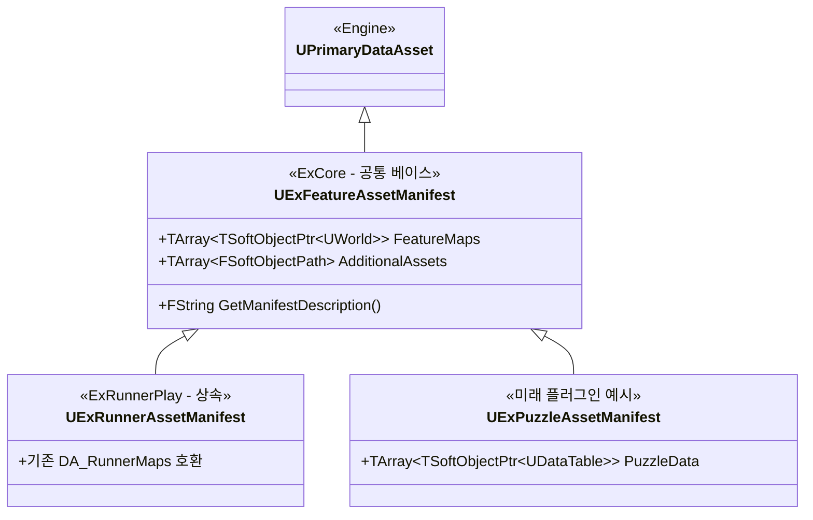

# GameFeature 에셋 매니페스트 시스템 — ExCore 공통화 구축

ExRunnerPlay 플러그인에서 맵 패키징 문제를 해결하기 위해 만들었던 `UExRunnerMapManifest`를 **ExCore 기반의 범용 매니페스트 시스템**으로 승격시켜, 향후 모든 GameFeature 플러그인이 맵·데이터테이블·기타 에셋 등을 **한 줄 상속만으로 간편하게 등록·관리**할 수 있도록 아키텍처를 구축합니다.

## 설계 배경 및 목표

### 현재 문제점
- `UExRunnerMapManifest`가 ExRunnerPlay 모듈 안에 하드코딩되어 있어, 새로운 GameFeature 플러그인(예: ExPuzzlePlay, ExBattlePlay 등)을 만들 때마다 동일한 클래스를 복붙해야 합니다.
- 맵 외에도 데이터테이블, 사운드 큐, 머티리얼 등 "플러그인이 켜질 때만 쿠킹"해야 하는 에셋 유형이 늘어날 수 있습니다.

### 설계 목표
1. **ExCore에 공통 베이스 클래스** (`UExFeatureAssetManifest`)를 두어, 모든 GameFeature 플러그인이 이를 상속받아 자신만의 매니페스트를 간편하게 만들 수 있게 합니다.
2. 맵뿐 아니라 **범용 에셋 참조 배열**도 함께 제공하여, 어떤 종류의 에셋이든 한 곳에서 통합 관리 가능하게 합니다.
3. 기존 `UExRunnerMapManifest`는 새 베이스를 상속받는 형태로 리팩터링하여 **하위 호환성**을 유지합니다.

---

## 제안 아키텍처



---

## User Review Required

> [!IMPORTANT]
> **기존 에셋 재생성 필요 여부**: 현재 ExRunnerPlay에서 만들어두신 `DA_RunnerMaps` 데이터 에셋은 `UExRunnerMapManifest` 클래스 기반입니다. 리팩터링 후 부모 클래스가 변경되므로 **에디터에서 DA_RunnerMaps를 삭제 후 재생성**하거나, 기존 에셋을 열어 `Reparent` 해야 할 수 있습니다.

> [!WARNING]
> **GameFeatureData 스캔 설정 변경**: ExRunnerPlay의 GameFeatureData 에셋에서 Asset Base Class를 기존 `ExRunnerMapManifest`에서 새로운 `ExRunnerAssetManifest`(또는 베이스 `ExFeatureAssetManifest`)로 변경해야 합니다. 주인님의 수동 작업이 필요합니다.

---

## Proposed Changes

### ExCore 모듈 (공통 베이스 추가)

#### [NEW] [ExFeatureAssetManifest.h](file:///c:/wz/ExFrameWork/Plugins/GameFeatures/ExCore/Source/ExCoreRuntime/Data/ExFeatureAssetManifest.h)

모든 GameFeature 플러그인이 상속받는 **공통 매니페스트 베이스 클래스**:

```cpp
#pragma once

#include "CoreMinimal.h"
#include "Engine/DataAsset.h"
#include "ExFeatureAssetManifest.generated.h"

/**
 * UExFeatureAssetManifest
 * 
 * GameFeature 플러그인에서 사용하는 에셋(맵, 데이터테이블, 사운드 등)을
 * 패키징 시 자동으로 쿠킹(포함)시키기 위한 공통 매니페스트 베이스 클래스.
 * 
 * 사용법:
 *   1. 각 GameFeature 플러그인에서 이 클래스를 상속받아 자신만의 매니페스트를 만듭니다.
 *   2. GameFeatureData 에셋의 Primary Asset Types to Scan에 해당 서브클래스를 등록합니다.
 *   3. Cook Rule을 AlwaysCook으로 설정하면 플러그인 활성화 시 자동으로 패키징에 포함됩니다.
 */
UCLASS(BlueprintType, Abstract)
class EXCORERUNTIME_API UExFeatureAssetManifest : public UPrimaryDataAsset
{
    GENERATED_BODY()

public:
    /** 이 플러그인에서 패키징에 포함시킬 맵(.umap) 파일 목록 */
    UPROPERTY(EditAnywhere, BlueprintReadOnly, Category = "Feature|Maps",
        meta = (DisplayName = "맵 목록"))
    TArray<TSoftObjectPtr<UWorld>> FeatureMaps;

    /** 맵 외에 추가로 패키징에 강제 포함시킬 범용 에셋 경로 목록 */
    UPROPERTY(EditAnywhere, BlueprintReadOnly, Category = "Feature|Assets",
        meta = (DisplayName = "추가 에셋 목록"))
    TArray<FSoftObjectPath> AdditionalAssets;

    /** 에디터 표시용 매니페스트 설명 (선택 사항) */
    UPROPERTY(EditAnywhere, BlueprintReadOnly, Category = "Feature|Info",
        meta = (DisplayName = "설명", MultiLine = true))
    FText ManifestDescription;
};
```

**핵심 설계 포인트:**
- `Abstract` UCLASS 지정자: 베이스 클래스 자체로는 데이터 에셋을 직접 만들 수 없게 방지합니다. 반드시 서브클래스를 통해서만 생성하도록 강제합니다.
- `FeatureMaps`: 맵 전용 배열 — `TSoftObjectPtr<UWorld>`로 에디터에서 맵만 선택 가능
- `AdditionalAssets`: 범용 배열 — `FSoftObjectPath`로 데이터테이블, 사운드 큐 등 어떤 에셋이든 등록 가능
- `ManifestDescription`: 에디터에서 이 매니페스트가 어떤 플러그인용인지 메모할 수 있는 텍스트 필드

#### [NEW] [ExFeatureAssetManifest.cpp](file:///c:/wz/ExFrameWork/Plugins/GameFeatures/ExCore/Source/ExCoreRuntime/Data/ExFeatureAssetManifest.cpp)

빈 구현 파일 (UPrimaryDataAsset 기본 동작 사용)

---

### ExRunnerPlay 모듈 (리팩터링)

#### [MODIFY] [ExRunnerMapManifest.h](file:///c:/wz/ExFrameWork/Plugins/GameFeatures/ExRunnerPlay/Source/ExRunnerPlayRuntime/Data/ExRunnerMapManifest.h)

기존의 독자적인 `UPrimaryDataAsset` 상속 → `UExFeatureAssetManifest` 상속으로 변경:

```diff
 #pragma once
 
 #include "CoreMinimal.h"
-#include "Engine/DataAsset.h"
+#include "ExFeatureAssetManifest.h"
 #include "ExRunnerMapManifest.generated.h"
 
 /**
- * UExRunnerMapManifest
- * ExRunnerPlay 플러그인에 종속된 맵 파일들을 패키징 시 자동으로 쿠킹(포함)시키기 위한 매니페스트 데이터 에셋.
+ * UExRunnerAssetManifest
+ * ExRunnerPlay 전용 매니페스트. ExCore의 공통 베이스를 상속받아
+ * 맵 및 추가 에셋을 통합 관리합니다.
  */
 UCLASS(BlueprintType)
-class EXRUNNERPLAYRUNTIME_API UExRunnerMapManifest : public UPrimaryDataAsset
+class EXRUNNERPLAYRUNTIME_API UExRunnerAssetManifest : public UExFeatureAssetManifest
 {
     GENERATED_BODY()
-
-public:
-    // 에디터에서 오직 맵(.umap) 파일만 배열로 선택할 수 있도록 강제 필터링합니다.
-    UPROPERTY(EditAnywhere, BlueprintReadOnly, Category = "Game Feature Maps")
-    TArray<TSoftObjectPtr<UWorld>> FeatureMaps;
 };
```

**변경 요약:**
- 클래스명: `UExRunnerMapManifest` → `UExRunnerAssetManifest` (네이밍 통일)
- 부모 클래스: `UPrimaryDataAsset` → `UExFeatureAssetManifest`
- `FeatureMaps` 변수 삭제: 부모에 이미 존재하므로 중복 제거
- 향후 Runner 전용 필드가 필요하면 이 서브클래스에 추가 가능

#### [MODIFY] [ExRunnerMapManifest.cpp](file:///c:/wz/ExFrameWork/Plugins/GameFeatures/ExRunnerPlay/Source/ExRunnerPlayRuntime/Data/ExRunnerMapManifest.cpp)

include 경로 및 클래스명 변경

---

## 적용 후 사용 흐름 (미래 플러그인 예시)

새로운 GameFeature 플러그인 `ExPuzzlePlay`를 만들 때:

```cpp
// ExPuzzlePlay/Source/ExPuzzlePlayRuntime/Data/ExPuzzleAssetManifest.h
#pragma once
#include "ExFeatureAssetManifest.h"
#include "ExPuzzleAssetManifest.generated.h"

UCLASS(BlueprintType)
class EXPUZZLEPLAYRUNTIME_API UExPuzzleAssetManifest : public UExFeatureAssetManifest
{
    GENERATED_BODY()

public:
    // 퍼즐 전용 추가 필드 (필요시)
    UPROPERTY(EditAnywhere, BlueprintReadOnly, Category = "Puzzle")
    TArray<TSoftObjectPtr<UDataTable>> PuzzleDataTables;
};
```

이것만으로 끝입니다! 나머지는 베이스 클래스가 `FeatureMaps`와 `AdditionalAssets`를 이미 가지고 있으므로 자동으로 사용 가능합니다.

---

## Open Questions

> [!IMPORTANT]
> **1. 클래스명 변경 범위**: 기존 `UExRunnerMapManifest`를 `UExRunnerAssetManifest`로 이름을 바꿀 경우, 에디터에서 이미 생성하신 데이터 에셋(`DA_RunnerMaps`)을 **삭제 후 재생성**해야 합니다. 이 작업이 괜찮으신지 확인 부탁드립니다.

> [!NOTE]
> **2. Abstract 지정자**: 베이스 클래스에 `Abstract`를 붙이면 에디터에서 직접 데이터 에셋을 만들 수 없고 반드시 서브클래스를 통해야 합니다. 반대로 `Abstract`를 빼면 베이스 클래스로도 직접 데이터 에셋을 만들 수 있어 빠르게 쓸 수 있지만, 플러그인별 구분이 느슨해집니다. 어느 쪽을 선호하시나요?

---

## Verification Plan

### 자동 검증
1. **에디터 컴파일**: ExCore, ExRunnerPlay 양쪽 모듈 빌드 성공 확인
2. **에디터 실행**: `DA_RunnerMaps` 데이터 에셋을 새 클래스(`UExRunnerAssetManifest`)로 재생성 → 맵 목록 정상 표시 확인
3. **윈도우 패키징**: 빌드 성공 및 `L_ExRunnerTest` 맵 포함 여부 확인

### 수동 검증
- 주인님이 빌드 PC에서 최종 패키징 결과물을 돌려 로비 → 게임 맵 전환이 정상적으로 동작하는지 확인
