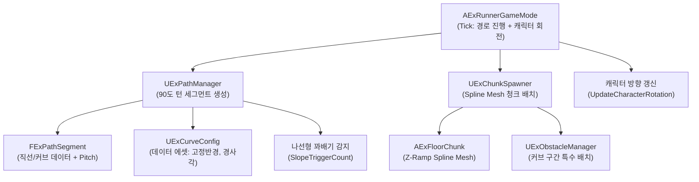

# 커브 Floor 청크 시스템 가이드

> **최종 업데이트**: 2026-02-12  
> **상태**: 코드 구현 완료, 에디터 설정 및 PIE 테스트 대기

이 문서는 러너 게임의 **커브 Floor 청크 시스템**의 설계, 구현 코드, 에디터 설정 방법,
그리고 향후 개선 사항을 종합적으로 기술합니다.

---

## 1. 시스템 개요

### 목적
기존 **X축 1차원 직선** 트레드밀에 **경로 기반 커브 Floor**를 추가하여,
게임 플레이 중 랜덤한 좌/우 커브가 발생하고 캐릭터가 경로를 따라 이동하는 시스템.

### 핵심 설계 방침

| 항목 | 결정 |
|------|------|
| Floor 메시 방식 | **Spline Mesh Component** (런타임 벤딩) |
| 커브 각도 | **4분면 기반 90도 고정** (월드 축 정렬) |
| 캐릭터 회전 | 캐릭터 회전 우선 → 향후 PlayerController/카메라 회전 확장 가능 |
| 겹침 방지 | **경사(Slope) 기반 꽈배기** (Pitch 적용으로 고도 변경) |
| 장애물 배치 | 커브 구간 **특수 배치 정책** (진입부 제한 등) |
| 커브 빈도 | **가중 확률 패턴 공식** |
| 시각적 힌트 | 추후 구현 (델리게이트 인터페이스 준비 완료) |

---

## 2. 아키텍처



### 데이터 흐름

1. **GameMode::Tick** → 트레드밀 속도 계산 → `DeltaDistance` 산출
2. **ChunkSpawner::ShiftWorldAlongPath** → 각 청크를 PathManager의 접선 방향으로 이동
3. **PathManager** → 90도 턴 생성 (빈도 공식), 꽈배기(Spiral) 감지 시 Pitch 적용
4. **FloorChunk::ApplyCurve** → Spline Mesh로 경사(Ramp)가 포함된 원호 바닥 렌더링 (Inverse Scale 적용)
5. **GameMode::UpdateCharacterRotation** → 경로 접선 방향으로 캐릭터 Yaw 보간

---

## 3. 코드 구조

... (기존 내용 유지)

## 8. 4분면(Quadrant) 및 꽈배기 시스템 (2026-02-12 추가)

기존의 불규칙한 랜덤 커브 대신, **90도 고정 회전**과 **경사(Slope)**를 이용한 규칙적인 경로 시스템으로 개편되었습니다.

### 8.1 4분면(Quadrant) 원칙
- 모든 커브는 **정확히 90도**로 회전하며, 월드 좌표계(X, Y) 축에 정렬됩니다.
- **고정 반경(`FixedCurveRadius`)**을 사용하여 예측 가능한 경로를 생성합니다.
- `ApplyCurve` 시 부모 액터의 스케일(10, 4, 0.1)을 역산(Inverse Scale)하여 왜곡 없는 원호를 그립니다.

### 8.2 나선형 꽈배기(Spiral Ramp)
- **문제**: 제자리에서 360도 회전(4번의 90도 턴)을 하면 바닥이 겹치는 Z-Fighting 발생.
- **해결**: 동일 방향으로 `SlopeTriggerCount`(기본 2회) 이상 회전 시, **경사(`SlopePitchAngle`)**를 적용하여 고도를 변경합니다.
    - `ExPathManager`: 연속 회전 횟수를 카운트하고, 세그먼트에 `HeightOffset`을 부여.
    - `ExFloorChunk`: Spline Mesh 생성 시 `HeightOffset`을 Z축 높이에 배분하여 부드러운 오르막/내리막 램프 생성.
    - **중앙 정렬**: 램프의 시작/끝 높이를 `-Height/2 ~ +Height/2`로 오프셋 처리하여, 인접 청크와 단차 없이 연결.

### 8.3 액터 회전 정책
- 나선형 구조에서 액터 자체가 Pitch/Roll 회전을 가지면 로컬 좌표계가 비틀려 Spline Mesh와 충돌합니다.
- 따라서 커브 구간의 청크 액터는 **수평(Yaw Only)** 상태를 유지하며, 고도 변화는 오직 Spline Mesh의 Z축 오프셋으로만 표현합니다.

---

## 9. 변경 이력

| 날짜 | 변경 내용 |
|------|-----------|
| 2026-02-12 | 초기 구현 완료 (8단계). Spline Mesh 커브, 데이터 드리븐, 꽈배기 바운딩, 캐릭터 회전, 장애물 특수 배치 |
| 2026-02-12 | 3개 치명 버그 수정: SpawnNextChunk 경로 연동, OnWorldShifted 부호 수정, KillZ PathDistance 기반 전환 |
| 2026-02-12 | **4분면(Quadrant) 시스템 개편**: 90도 고정 턴, 나선형 꽈배기(Pitch Ramp), Inverse Scale 복구 |

---

## 3. 코드 구조

### 신규 파일

| 파일 | 경로 | 역할 |
|------|------|------|
| `FExPathSegment.h/cpp` | `Struct/` | 경로 세그먼트 구조체 + 원호 보간 |
| `ExCurveConfig.h` | `Data/` | 데이터 드리븐 커브 설정 (각도/반경/빈도/높이/Spline) |
| `ExPathManager.h/cpp` | `Components/` | 세그먼트 생성, 거리→좌표, 꽈배기 바운딩 |

### 수정 파일

| 파일 | 변경 내용 |
|------|-----------|
| `ExFloorChunk.h/cpp` | `ApplyCurve()` / `ClearCurve()` / `ActivateChunkWithRotation()` / `PathDistance` / `SegmentType` |
| `ExChunkSpawner.h/cpp` | `ShiftWorldAlongPath()` / `NextSpawnDistance` |
| `ExRunnerGameMode.h/cpp` | `PathManager` 통합 / `UpdateCharacterRotation()` / `CurrentPathDistance` |
| `ExObstacleManager.h/cpp` | `ShouldSpawnObstaclesOnCurve()` / 커브 배치 제한 체크 |

---

## 4. 핵심 알고리즘

### 4.1 커브 빈도 패턴 공식

```
P(커브발생) = min(1.0, CurveProbabilityBase + (연속직선수 - MinStraightChunks) * CurveProbabilityGrowth)
```

- `연속직선수 < MinStraightChunks` → P = 0 (커브 발생 안 함)
- `연속직선수 >= MaxStraightChunks` → P = 1 (100% 커브 발생)
- 기본값: Base=0.3, Growth=0.15, Min=3, Max=8

### 4.2 꽈배기 Z축 바운딩

```cpp
// 같은 방향 커브 360° 이상 누적 시 (꽈배기 확정)
if (AccumulatedSameDirectionYaw >= 360.f)
{
    CurrentHeightOffset += HeightStepPerLoop * HeightDirection;
    
    // 상한 도달 → 다음 꽈배기는 하강
    if (CurrentHeightOffset >= MaxHeightOffset)
        HeightDirection = -1;
    // 하한 도달 → 다음 꽈배기는 상승
    else if (CurrentHeightOffset <= MinHeightOffset)
        HeightDirection = +1;
}
```

- 머티리얼/파티클 이펙트 적용 공간을 벗어나지 않도록 바운딩
- 높이 한쪽 끝 도달 시 자동으로 반대 방향 전환

### 4.3 원호 보간 (FExPathSegment)

```cpp
// 커브 구간에서 Alpha(0~1) 진행률에 따른 위치 계산
FVector Center = StartWorldPos + Right * CurveRadius;  // 원의 중심
FVector RadialStart = StartWorldPos - Center;           // 반지름 벡터
FVector RotatedRadial = RadialStart.RotateAngleAxis(    // Z축 회전
    CurrentAngleDeg * RotSign, FVector::UpVector);
FVector Result = Center + RotatedRadial;                // 원호 위의 점
```

### 4.4 캐릭터 회전

```cpp
// 경로 접선 방향으로 부드러운 Yaw 보간 (Pitch/Roll 보존)
FRotator NewRotation = FMath::RInterpTo(
    CurrentRotation, PathDirection,
    DeltaTime, CurveConfig->CharacterRotationInterpSpeed);
NewRotation.Pitch = CurrentRotation.Pitch;
NewRotation.Roll = CurrentRotation.Roll;
```

- `ExRunnerMovementComponent`는 `GetActorForwardVector()`를 사용하므로,
  캐릭터 회전이 갱신되면 이동 방향이 자동으로 경로 추적됨

---

## 9. 장애물 시스템 연동 (Obstacle Integration) (2026-02-12 추가)

곡선 경로에서 장애물이 직선으로 배치되거나 겹치는 문제를 해결하기 위해, 장애물 시스템을 **경로 거리(Path Distance)**와 **로컬 커브 변환(Local Curve Transform)** 기반으로 전면 개편했습니다.

### 9.1 경로 거리 기반 배치 (Path Distance Spacing)
- **문제**: 기존 월드 X 좌표(`SafeEndX`) 기반 배치는 90도 커브 구간에서 X좌표 변화가 미미하여 장애물이 겹치는(Overlap) 현상 발생.
- **해결**: 모든 배치 간격 판정을 `Chunk->PathDistance`(경로 누적 거리) 기준으로 변경.
    - `LastObstacleSafeEndDistance` 변수로 마지막 장애물의 **경로 상 끝 위치**를 추적.
    - 청크 진입 시 `SafeStartDist = max(LastSafeDist, ChunkStartDist)`로 판정하여, 커브 유무와 관계없이 일정 간격 유지.

### 9.2 커브 로컬 변환 (Local Curve Transform)
- **문제**: 장애물이 월드 좌표계에 정렬되어, 커브 구간에서도 회전하지 않고 직선으로 배치됨.
- **해결**: `AExFloorChunk`에 커브 수학을 내장하여 정확한 위치와 회전값 제공.
    ```cpp
    // ExFloorChunk.h
    FTransform GetLocalTransformAtDistance(float LocalDistance) const;
    ```
    - `ExObstacleSpawnStrategy`는 이 함수를 호출하여 장애물의 Transform(위치+회전)을 획득.
    - **Y 오프셋**: 장애물 피벗(Edge) 보정을 위해 로컬 Y축 이동(`TargetWidth * -0.5`) 적용.
    - **Z 오프셋**: Slide 장애물 등의 높이 보정을 로컬 Z축 이동으로 적용.
    - **Scale 보존**: `ConfigureObstacle`에서 계산된 스케일(넓이 등)이 Transform 적용 시 초기화되지 않도록 병합 로직 추가.

---

## 10. 향후 계획 (Future Plans)

현재 구현된 시스템의 안정화 및 추가 검증을 위해 다음 항목들이 계획되어 있습니다. 참고 바랍니다.

### 10.1 꽈배기(Floor 기울기) 처리 확인 검증
- **검증 대상**: 나선형으로 연속 회전 시 `SlopePitchAngle`이 적용되어 고도가 변경되는 로직(꽈배기)이 시각적/물리적으로 올바르게 동작하는지 확인.
- **체크포인트**: 
    - Chunk 연결 부위의 단차(Gap) 발생 여부.
    - 캐릭터가 경사로를 자연스럽게 오르내리는지 여부.

### 10.2 캐릭터 낙하 현상 분석 (Floor 삭제 타이밍)
- **증상**: 간헐적으로 캐릭터가 바닥이 없는 허공으로 떨어지는 현상 발생.
- **추정 원인**: `ExChunkSpawner`의 청크 회수(ReturnToPool) 타이밍이 너무 빠르거나, 커브 구간에서 `KillZ` 판정(거리 기반)이 예상보다 일찍 트리거될 가능성.
- **대응 계획**:
    - `SafeKillDistance` 여유값 증대 고려.
    - 디버그 로그를 통해 청크 소멸 시점과 캐릭터 위치 정밀 추적.

### 10.3 점프 중 회전 반영 테스트
- **고민 사항**: 캐릭터가 점프(Airborne) 상태일 때도 경로의 곡률에 맞춰 회전(Yaw)을 계속 보정해야 하는가?
- **테스트 계획**:
    - **Case A (현행)**: 점프 중에도 `UpdateCharacterRotation`이 동작하여 공중에서 경로 방향으로 회전. (착지 안정성 유리)
    - **Case B**: 점프 시 회전 고정. (관성 보존 느낌, 하지만 착지 시 경로 이탈 위험)
    - 두 케이스 비교 후 결정.

### 10.4 Gap 타입 장애물 오브젝트 처리 확인
- **검증 대상**: `ExObstacleStrategy_Gap`이 커브 구간에서도 바닥 메시에 구멍(Gap)을 올바르게 뚫는지 확인.
- **체크포인트**:
    - `ApplyGap` 함수가 커브의 Local X 좌표를 기준으로 올바른 지점을 슬라이싱(Slicing) 하는지.
    - 슬라이싱 된 단면(Cap)이 커브의 휜 형상을 따라 자연스럽게 마감되는지, 혹은 직선으로 잘려 이질감이 있는지 확인.

// (2026-02-12) 문서 정리 완료. 향후 변경 사항은 별도 기록.
