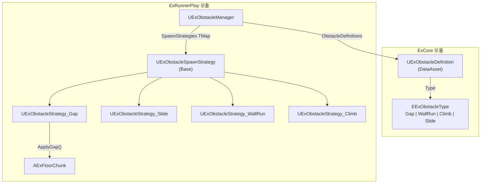
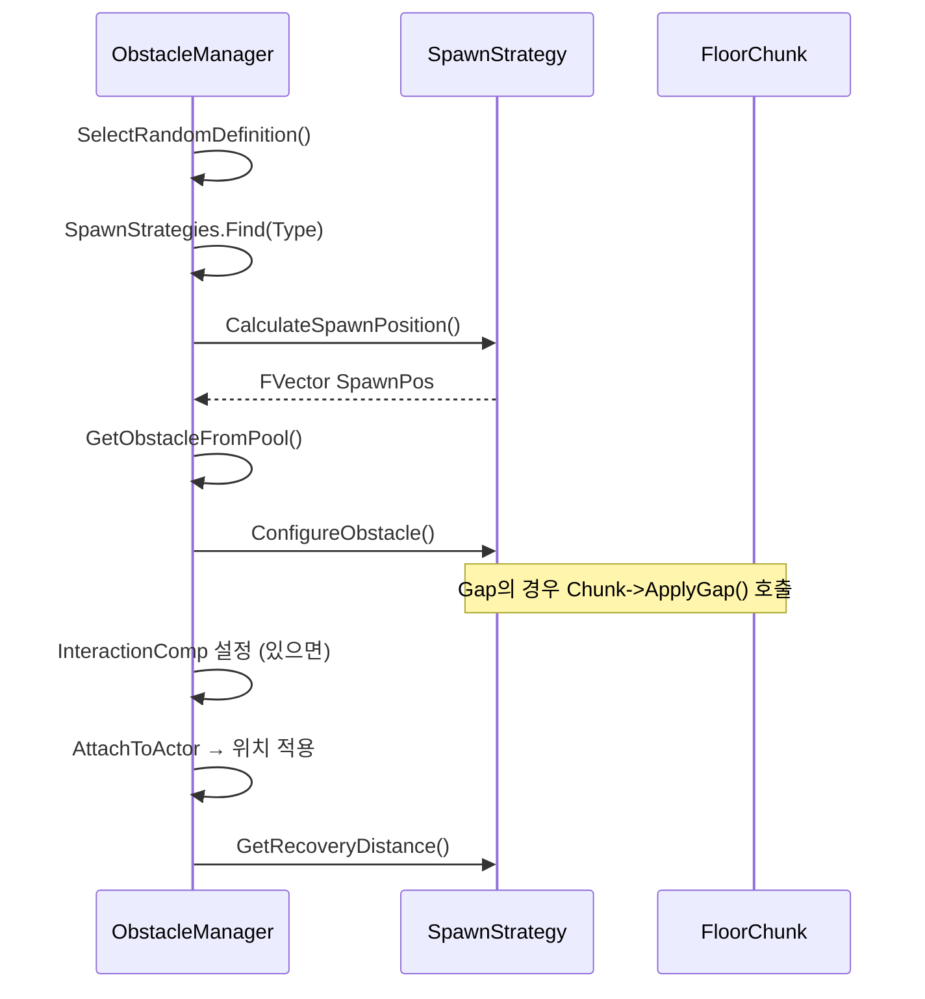

# 장애물 시스템 종합 가이드

> 작성일: 2026-02-10 | 최종 수정: 2026-02-11  
> Strategy Pattern 기반 장애물 스폰 시스템

---

## 1. 아키텍처 개요

### 배경
기존 `SpawnObstaclesOnChunk`는 모든 `EExObstacleType`을 하나의 로직으로 처리하여
타입 추가 시 함수가 비대해지는 문제가 있었음. **Strategy Pattern**으로 타입별 로직을 분리.

### 구조도



### 위임 분리

| 단계 | 처리 주체 | 함수 |
|------|-----------|------|
| 랜덤 선택 | Manager (공통) | `SelectRandomDefinition()` |
| 전략 탐색 | Manager (공통) | `SpawnStrategies.Find()` |
| 배치 가능성 | Manager (공통) | `CheckFeasibility()` |
| **위치 계산** | **Strategy (위임)** | `CalculateSpawnPosition()` |
| 풀링 | Manager (공통) | `GetObstacleFromPool()` |
| **스케일/크기** | **Strategy (위임)** | `ConfigureObstacle()` |
| Interaction | Manager (공통) | `InteractionComp` 설정 |
| 어태치 | Manager (공통) | `AttachToActor()` |
| **복귀 거리** | **Strategy (위임)** | `GetRecoveryDistance()` |

### 스폰 흐름



---

## 2. EExObstacleType 열거형

| 값 | 설명 | 캐릭터 동작 | 구현 상태 |
|---|---|---|---|
| `None` | 기본값 | — | — |
| `Gap` | 바닥 구멍 | 점프로 건너뛰기 | ✅ 완료 |
| `Slide` | 천장형 장애물 | Crouch/Slide로 통과 | ✅ 완료 |
| `WallRun` | 측면 벽 | 벽타기로 통과 | ⬜ 스텁 |
| `Climb` | 높은 벽 | 매달려 올라가기 | ⬜ 스텁 |

---

## 3. Strategy 클래스 상세

### 3-1. Base — UExObstacleSpawnStrategy

모든 전략의 부모 클래스. WallRun/Climb은 현재 이 기본 로직을 사용.

| 함수 | 역할 |
|------|------|
| `ConfigureObstacle` | 스케일 1 리셋 → 메시 바운드 측정 → X/Y/Z 비율 스케일 적용 |
| `CalculateSpawnPosition` | SafeStartX + 200, **Y 피봇 보정** |
| `GetRecoveryDistance` | `RecoveryTime × RunSpeed` |

**파일:**
- `Plugins/GameFeatures/ExRunnerPlay/Source/ExRunnerPlayRuntime/Data/ExObstacleSpawnStrategy.h`
- `Plugins/GameFeatures/ExRunnerPlay/Source/ExRunnerPlayRuntime/Data/ExObstacleSpawnStrategy.cpp`

---

### 3-2. Gap — UExObstacleStrategy_Gap

바닥에 구멍을 만들어 점프로 건너뛰는 장애물.

**핵심:** `AExFloorChunk::ApplyGap()` → FloorMesh 숨기고 양쪽 바닥 조각 생성

| 항목 | 내용 |
|------|------|
| **ConfigureObstacle** | Gap 폭 랜덤 → `Chunk->ApplyGap(LocalStartX, Width)` → 스케일 설정 (X=Gap폭, Y=Floor너비) |
| **CalculateSpawnPosition** | 바닥 레벨 (Z 오프셋 없음), Y 피봇 보정 |
| **CachedSpawnX** | CalculateSpawnPosition → ConfigureObstacle 간 데이터 전달용 |
| **FloorChunk 연동** | `ApplyGap()` / `ClearGap()` — DeactivateChunk 시 자동 복원 |

**전용 프로퍼티:**

| 프로퍼티 | 용도 | 기본값 |
|----------|------|--------|
| `bDisableFloorMesh` | Gap 전용 플래그 | `true` |
| `MinSize.X / MaxSize.X` | Gap 최소/최대 폭 (cm) | — |

**파일:**
- `Plugins/GameFeatures/ExRunnerPlay/Source/ExRunnerPlayRuntime/Data/ExObstacleStrategy_Gap.h`
- `Plugins/GameFeatures/ExRunnerPlay/Source/ExRunnerPlayRuntime/Data/ExObstacleStrategy_Gap.cpp`

---

### 3-3. Slide — UExObstacleStrategy_Slide

천장형 장애물. Crouch/Slide로 아래 공간을 통과.

**핵심:** Mover의 `StanceSettings::CrouchHalfHeight`를 런타임에 읽어 통과 높이 결정

| 항목 | 내용 |
|------|------|
| **ConfigureObstacle** | X=두께(랜덤), Y=Floor너비, Z=높이(랜덤) |
| **CalculateSpawnPosition** | Z = `FloorZ + CrouchPassHeight` (런타임 캐릭터 데이터) |
| **ClearanceMargin** | UPROPERTY, 캡슐-장애물 하단 여유 마진 (기본 15cm) |
| **GetCrouchPassHeight** | `CrouchHalfHeight × 2 + Margin`, Fallback 120cm |

**파일:**
- `Plugins/GameFeatures/ExRunnerPlay/Source/ExRunnerPlayRuntime/Data/ExObstacleStrategy_Slide.h`
- `Plugins/GameFeatures/ExRunnerPlay/Source/ExRunnerPlayRuntime/Data/ExObstacleStrategy_Slide.cpp`

---

### 3-4. WallRun — UExObstacleStrategy_WallRun (스텁)

벽 달리기 장애물. 현재 Base 로직 사용.

| 프로퍼티 | 용도 | 기본값 |
|----------|------|--------|
| `WallHeight` | 벽 높이 | 300cm |

**TODO:** 측면 벽 생성, Y축 오프셋 구현

**파일:** `Plugins/GameFeatures/ExRunnerPlay/Source/ExRunnerPlayRuntime/Data/ExObstacleStrategy_WallRun.h`

---

### 3-5. Climb — UExObstacleStrategy_Climb (스텁)

매달려 올라가기 장애물. 현재 Base 로직 사용.

| 프로퍼티 | 용도 | 기본값 |
|----------|------|--------|
| `ClimbHeight` | 올라가는 높이 | 400cm |

**TODO:** 머리 높이 배치, ClimbHeight 기반 Z축 중심 스케일 구현

**파일:** `Plugins/GameFeatures/ExRunnerPlay/Source/ExRunnerPlayRuntime/Data/ExObstacleStrategy_Climb.h`

---

## 4. ExObstacleDefinition 프로퍼티

### 공통

| 프로퍼티 | 카테고리 | 용도 | 기본값 |
|----------|----------|------|--------|
| `ObstacleClass` | Obstacle | 스폰할 BP 클래스 | — |
| `MinSize` | Obstacle | 최소 크기 (X=길이, Y=폭, Z=높이) | (100, 1000, 100) |
| `MaxSize` | Obstacle | 최대 크기 | (200, 1000, 150) |
| `Type` | Obstacle | `EExObstacleType` | None |
| `RecoveryTime` | Logic | 통과 후 복귀 시간 (초) | 1.0 |
| `MinEntrySpeed` | Logic | 최소 진입 속도 | 400.0 |
| `VerticalOffset` | Placement | 바닥 Z 오프셋 | 0.0 |

### 타입별 전용 (EditConditionHides)

| Type | 프로퍼티 | 기본값 | 설명 |
|------|----------|--------|------|
| Gap | `bDisableFloorMesh` | `true` | 바닥 메시 제거 플래그 |
| WallRun | `WallHeight` | 300cm | 벽 높이 |
| Climb | `ClimbHeight` | 400cm | 올라가는 높이 |

```cpp
// 타입별 조건부 프로퍼티 노출 패턴
UPROPERTY(EditAnywhere, meta = (
    EditCondition = "Type == EExObstacleType::Gap",
    EditConditionHides))
bool bDisableFloorMesh = true;
```

**파일:** `Plugins/GameFeatures/ExCore/Source/ExCoreRuntime/Data/ExObstacleDefinition.h`

---

## 5. 설계 결정사항

### Strategy 클래스 위치
- **ExRunnerPlay** 모듈 배치 (Runner 전용, Core 불필요)

### BP 대응
- `BlueprintNativeEvent` → C++ 기본 구현 + BP 오버라이드 지원
- `Blueprintable` + `EditInlineNew` → BP 서브클래스 및 에디터 인라인 편집

### Y 피봇 보정

> [!NOTE]
> 모든 Strategy의 `CalculateSpawnPosition`에서 **Y 피봇 보정** 적용.
> 장애물 메시 피봇이 끝(edge)에 있어 `ChunkLoc.Y - (FloorWidth * 0.5f)` 오프셋 필요.
> BP 메시 피봇이 중앙인 경우 이중 적용 주의.

---

## 6. Manager 등록 구조

```
UExObstacleManager
├── ObstacleDefinitions: TArray<UExObstacleDefinition*>
│   ├── DA_ExGap      (Type: Gap)
│   ├── DA_ExSlide     (Type: Slide)
│   ├── DA_ExWallRun   (Type: WallRun)
│   └── DA_ExClimb     (Type: Climb)
│
└── SpawnStrategies: TMap<EExObstacleType, UExObstacleSpawnStrategy*>
    ├── Gap     → UExObstacleStrategy_Gap (인라인)
    ├── Slide   → UExObstacleStrategy_Slide (인라인)
    ├── WallRun → UExObstacleStrategy_WallRun (인라인)
    └── Climb   → UExObstacleStrategy_Climb (인라인)
```

---

## 7. 확장 가이드

새로운 장애물 타입 추가 시:

1. `EExObstacleType`에 새 값 추가
2. `UExObstacleSpawnStrategy`를 상속한 새 Strategy 클래스 생성 (C++ 또는 BP)
3. `ConfigureObstacle`, `CalculateSpawnPosition` 구현
4. 에디터에서 `SpawnStrategies` TMap에 새 타입-전략 매핑 추가
5. (선택) `ExObstacleDefinition.h`에 새 타입 전용 파라미터 추가

---

## 파일 목록

### Strategy 클래스 (ExRunnerPlay/Data/)

| 파일 | 역할 |
|------|------|
| `ExObstacleSpawnStrategy.h/cpp` | 베이스 클래스 (BlueprintNativeEvent) |
| `ExObstacleStrategy_Gap.h/cpp` | Gap 전략 (바닥 제거, ApplyGap) |
| `ExObstacleStrategy_Slide.h/cpp` | Slide 전략 (런타임 Crouch 높이) |
| `ExObstacleStrategy_WallRun.h` | WallRun 전략 (스텁) |
| `ExObstacleStrategy_Climb.h` | Climb 전략 (스텁) |

### Manager/Definition

| 파일 | 변경 내용 |
|------|-----------| 
| `ExObstacleManager.h/cpp` | `TMap<Type, Strategy*>`, Strategy 위임 리팩토링 |
| `ExObstacleDefinition.h` | 타입별 조건부 프로퍼티 (`EditConditionHides`) |
| `ExFloorChunk.h/cpp` | `ApplyGap()` / `ClearGap()` Gap 바닥 제거 기능 |

---

## 8. 장애물 정보 연동 (Interface)

Strategy에서 랜덤으로 결정된 장애물의 크기나 타입 정보를 **장애물 액터(BP)**가 알 수 있도록 인터페이스를 통해 정보를 전달합니다.

### 8-1. 구조

- **`FExObstacleInfo` (Struct)**
  - `Type`: 장애물 타입 (`Gap`, `Slide`, `Climb` 등)
  - `Value`: 핵심 크기 정보 (**미터(m) 단위**, 소수점 2자리 반올림)
    - `Gap` / `Slide` / `WallRun`: **X축 길이 (폭/두께)**
    - `Climb`: **Z축 높이**

- **`IExObstacleInterface` (Interface)**
  - `SetupObstacleInfo(const FExObstacleInfo& Info)`: 정보 전달 함수

### 8-2. BP 구현 가이드

장애물 블루프린트(`BP_ExLevelBlock` 등)에서 이 정보를 받아 텍스트 렌더링이나 로직에 활용하려면 다음 절차를 따릅니다.

1.  **인터페이스 추가**:
    -   Class Settings -> Interfaces -> Add -> **`ExObstacleInterface`** 검색 및 추가

2.  **이벤트 구현**:
    -   이벤트 그래프(Event Graph)에서 우클릭 -> **`Event Setup Obstacle Info`** 추가 (빨간색 이벤트 노드)

3.  **정보 활용**:
    -   노드의 **`Info` 핀**을 분해(Break)하여 `Type`과 `Value`를 얻습니다.
    -   `Value`는 **미터(m)** 단위이므로, TextRender에 바로 연결하여 표시하거나 스케일 조정 로직에 활용할 수 있습니다.

> [!TIP]
> **왜 인터페이스를 사용하나요?**
> 장애물의 크기는 스폰 시점의 `Strategy` 로직 내부에서 랜덤으로 결정됩니다. 액터 스스로는 자신이 얼마만한 크기로 스폰되었는지 알 수 없으므로, Strategy가 `SetupObstacleInfo`를 호출하여 정보를 **주입(Push)**해주는 방식이 필요합니다.

