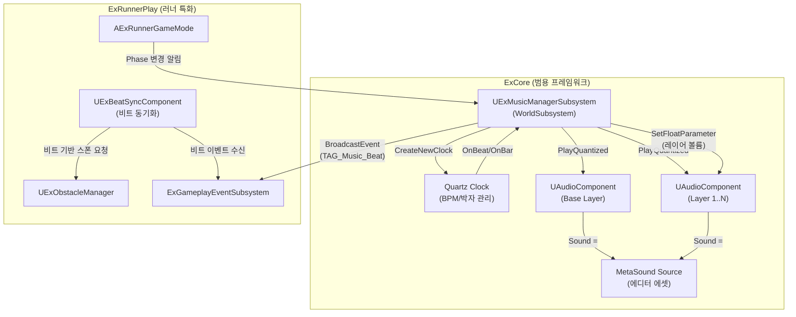

# ExRunner BGM 시스템 개발 계획서

러너 게임의 핵심인 **리듬 기반 BGM 시스템**을 UE5의 Quartz Clock + MetaSound를 활용하여 구현합니다.
비트에 맞춰 장애물이 스폰되고, 게임 Phase에 따라 음악 레이어가 동적으로 믹싱되는 시스템입니다.

> ⚠️ **현재 구현 상태 (2026-06-22 기준) — 본 계획 대비 변경점:**
> - `UExMusicManagerSubsystem`, `UExBeatSyncComponent`, `ExMusicTags.h/.cpp` 모두 구현되어 있음. 다만 **API 시그니처가 본 문서의 초안과 달라짐**:
>   - 계획: `StartBGM(USoundBase*, float BPM)` (사운드/BPM 직접 전달)  →  **실제: `StartBGM(const UExBGMTrackDataAsset*)` (데이터 에셋 기반)**. `SetBPM()`, `TransitionToPhase(FGameplayTag)`, `PauseBGM()` 등으로 확장됨.
>   - BeatSync의 `SpawnProbabilityPerBeat` 등 파라미터는 컴포넌트 프로퍼티가 아니라 **`ExRunnerConfig`(DataCenter)에서 로드**하도록 변경됨.
> - 본문 코드 예시는 초기 설계 기준이므로, 정확한 시그니처는 `ExMusicManagerSubsystem.h` 및 `ExFrameWork_Sound_System_Architecture.md`를 우선 참조.

---

## User Review Required

> [!IMPORTANT]
> **BGM 에셋 관련**: MetaSound Source 에셋(`.uasset`)은 에디터에서 직접 생성해야 합니다. C++ 코드에서는 `TSoftObjectPtr`로 참조하며, 실제 MetaSound 그래프 구성은 에디터 작업이 필요합니다.

> [!IMPORTANT]
> **모듈 배치 결정**: `UExMusicManagerSubsystem`은 다른 장르에서도 재사용 가능한 범용 음악 관리 시스템이므로 **ExCore**에 배치할 것을 제안합니다. 러너 특화 비트 동기화 로직은 **ExRunnerPlay**에 별도 컴포넌트로 구현합니다. 주인님의 의견을 확인하고 싶습니다.

> [!WARNING]
> **인게임 Phase 세분화**: 현재 `ExGameFlowSubsystem`의 Flow 상태는 앱 레벨(`Boot→IDP→Lobby→InGame`)입니다. BGM 레이어 믹싱에 필요한 **인게임 내부 Phase**(Warmup → Running → Climax → Cooldown 등)는 별도 태그 및 상태 관리가 필요합니다. 이를 `ExRunnerGameMode` 또는 새로운 서브시스템에서 관리할지 결정이 필요합니다.

---

## 시스템 아키텍처 개요



---

## 1단계: 기본 BGM 루프 시스템

### 목표
Quartz Clock으로 BPM을 관리하고, MetaSound Source를 통해 기본 BGM 루프를 재생합니다.

---

### ExCore - 음악 관리 서브시스템

#### [NEW] [ExMusicManagerSubsystem.h](file:///c:/wz/ExFrameWork/Plugins/GameFeatures/ExCore/Source/ExCoreRuntime/Subsystems/ExMusicManagerSubsystem.h)

새로운 `UWorldSubsystem` 기반 음악 관리자:

```cpp
UCLASS()
class EXCORERUNTIME_API UExMusicManagerSubsystem : public UWorldSubsystem
{
    GENERATED_BODY()

public:
    /** BGM 시작 (Quartz Clock 생성 + MetaSound 재생) */
    UFUNCTION(BlueprintCallable, Category = "Ex|Music")
    void StartBGM(USoundBase* InBGMSound, float BPM = 140.f);

    /** BGM 정지 (페이드아웃 후 Clock 삭제) */
    UFUNCTION(BlueprintCallable, Category = "Ex|Music")
    void StopBGM(float FadeOutDuration = 1.0f);

    /** 현재 BPM 변경 */
    UFUNCTION(BlueprintCallable, Category = "Ex|Music")
    void SetBPM(float NewBPM);

    /** 비트 이벤트 델리게이트 (C++ 바인딩용) */
    DECLARE_DYNAMIC_MULTICAST_DELEGATE_TwoParams(FOnBeatEvent, int32, BeatIndex, EQuartzCommandQuantization, QuantizationType);
    
    UPROPERTY(BlueprintAssignable, Category = "Ex|Music")
    FOnBeatEvent OnBeatEvent;

protected:
    virtual bool ShouldCreateSubsystem(UObject* Outer) const override;
    virtual void Deinitialize() override;

    /** Quartz 비트 콜백 핸들러 */
    UFUNCTION()
    void HandleQuantizationEvent(EQuartzCommandDelegateSubType EventType, FName ClockName);

private:
    /** Quartz Clock 핸들 */
    UPROPERTY()
    TObjectPtr<UQuartzClockHandle> BGMClockHandle;

    /** BGM 오디오 컴포넌트 (베이스 레이어) */
    UPROPERTY()
    TObjectPtr<UAudioComponent> BaseLayerAudioComp;

    /** 현재 BPM */
    float CurrentBPM = 140.f;

    /** 현재 비트 인덱스 (4/4 박자 기준) */
    int32 CurrentBeatIndex = 0;

    /** Quartz Clock 이름 */
    static const FName BGMClockName;
};
```

핵심 구현 로직:
- `StartBGM()`: `UQuartzSubsystem::CreateNewClock()` → `FQuartzClockSettings`(BPM, 4/4 박자) → `UAudioComponent::PlayQuantized()` 로 비트 정렬 재생
- `HandleQuantizationEvent()`: Beat/Bar 이벤트 수신 → `OnBeatEvent` 델리게이트 브로드캐스트 + `ExGameplayEventSubsystem::BroadcastEvent(TAG_Music_Beat)` 발행
- `StopBGM()`: Audio FadeOut → Clock 삭제 → 상태 초기화

#### [NEW] [ExMusicManagerSubsystem.cpp](file:///c:/wz/ExFrameWork/Plugins/GameFeatures/ExCore/Source/ExCoreRuntime/Subsystems/ExMusicManagerSubsystem.cpp)

위 헤더의 구현부.

---

#### [NEW] [ExMusicTags.h](file:///c:/wz/ExFrameWork/Plugins/GameFeatures/ExCore/Source/ExCoreRuntime/Tags/ExMusicTags.h)

음악 관련 GameplayTag 정의:

```cpp
namespace ExMusicTags
{
    // 비트 이벤트
    EXCORERUNTIME_API UE_DECLARE_GAMEPLAY_TAG_EXTERN(Music_Beat);         // 매 비트
    EXCORERUNTIME_API UE_DECLARE_GAMEPLAY_TAG_EXTERN(Music_Bar);          // 매 마디
    EXCORERUNTIME_API UE_DECLARE_GAMEPLAY_TAG_EXTERN(Music_Beat_Strong);  // 강박 (1, 3번째 비트)
    
    // Phase 태그 (2단계에서 활용)
    EXCORERUNTIME_API UE_DECLARE_GAMEPLAY_TAG_EXTERN(Music_Phase_Warmup);
    EXCORERUNTIME_API UE_DECLARE_GAMEPLAY_TAG_EXTERN(Music_Phase_Running);
    EXCORERUNTIME_API UE_DECLARE_GAMEPLAY_TAG_EXTERN(Music_Phase_Climax);
    EXCORERUNTIME_API UE_DECLARE_GAMEPLAY_TAG_EXTERN(Music_Phase_Cooldown);
}
```

#### [NEW] [ExMusicTags.cpp](file:///c:/wz/ExFrameWork/Plugins/GameFeatures/ExCore/Source/ExCoreRuntime/Tags/ExMusicTags.cpp)

태그 정의 구현부.

---

#### [MODIFY] [ExCoreRuntime.Build.cs](file:///c:/wz/ExFrameWork/Plugins/GameFeatures/ExCore/Source/ExCoreRuntime/ExCoreRuntime.Build.cs)

```diff
 PublicDependencyModuleNames.AddRange(
     new string[]
     {
         "Core",
         "CoreUObject",
         "Engine",
+        "AudioMixer",        // Quartz Subsystem, ClockHandle
         "ModularGameplay",
```

`Subsystems/` 폴더는 이미 공용 Include 경로에 등록되어 있음.

---

### MetaSound 에셋 (에디터 작업)

에디터에서 생성해야 할 MetaSound Source 에셋:

| 에셋명 | 경로 | 설명 |
|--------|------|------|
| `MS_BGM_Base` | `Content/Audio/Music/MS_BGM_Base` | 기본 BGM 루프. Wave Player + 루프 설정 |

MetaSound 그래프 내 노출할 파라미터 (Graph Input):

| 파라미터명 | 타입 | 용도 |
|-----------|------|------|
| `LayerVolume_Base` | Float | 베이스 레이어 볼륨 (0~1) |
| `LayerVolume_Melody` | Float | 멜로디 레이어 볼륨 (2단계) |
| `LayerVolume_Percussion` | Float | 퍼커션 레이어 볼륨 (2단계) |
| `LayerVolume_Intensity` | Float | 강도 레이어 볼륨 (2단계) |

---

## 2단계: Phase 연동 레이어 믹싱

### 목표
러너 게임의 인게임 Phase(Warmup→Running→Climax→Cooldown)에 따라 음악 레이어를 동적으로 믹싱합니다.

---

### ExCore - 음악 레이어 관리 확장

#### [MODIFY] [ExMusicManagerSubsystem.h](file:///c:/wz/ExFrameWork/Plugins/GameFeatures/ExCore/Source/ExCoreRuntime/Subsystems/ExMusicManagerSubsystem.h)

레이어 관리 기능 추가:

```cpp
/** 음악 레이어 정의 */
USTRUCT(BlueprintType)
struct FExMusicLayerConfig
{
    GENERATED_BODY()

    /** 레이어 식별자 */
    UPROPERTY(EditAnywhere, BlueprintReadWrite)
    FName LayerName;

    /** 해당 레이어의 MetaSound 파라미터명 */
    UPROPERTY(EditAnywhere, BlueprintReadWrite)
    FName VolumeParameterName;

    /** 현재 볼륨 (0~1) */
    UPROPERTY(VisibleAnywhere, BlueprintReadOnly)
    float CurrentVolume = 0.f;

    /** 목표 볼륨 (보간 대상) */
    UPROPERTY(VisibleAnywhere, BlueprintReadOnly)
    float TargetVolume = 0.f;
};

/** Phase별 레이어 볼륨 프리셋 */
USTRUCT(BlueprintType)
struct FExMusicPhasePreset
{
    GENERATED_BODY()

    UPROPERTY(EditAnywhere, BlueprintReadWrite)
    FGameplayTag PhaseTag;

    /** 레이어명 → 목표 볼륨 매핑 */
    UPROPERTY(EditAnywhere, BlueprintReadWrite)
    TMap<FName, float> LayerVolumes;

    /** 전환 시간 (초) */
    UPROPERTY(EditAnywhere, BlueprintReadWrite)
    float TransitionDuration = 2.0f;
};
```

새로 추가될 함수:
```cpp
/** 음악 Phase 전환 (레이어 볼륨 보간 시작) */
UFUNCTION(BlueprintCallable, Category = "Ex|Music")
void TransitionToPhase(FGameplayTag NewPhaseTag);

/** 개별 레이어 볼륨 직접 설정 */
UFUNCTION(BlueprintCallable, Category = "Ex|Music")
void SetLayerVolume(FName LayerName, float TargetVolume, float TransitionTime = 1.0f);
```

추가 멤버:
```cpp
/** 레이어 설정 목록 */
UPROPERTY()
TArray<FExMusicLayerConfig> MusicLayers;

/** Phase 프리셋 정의 (데이터 드리븐) */
UPROPERTY()
TObjectPtr<UExMusicPhaseDataAsset> PhasePresetData;

/** 현재 음악 Phase */
FGameplayTag CurrentMusicPhase;
```

Tick에서 `CurrentVolume → TargetVolume` 보간 수행 → `AudioComp->SetFloatParameter()` 호출.

---

#### [NEW] [ExMusicPhaseDataAsset.h](file:///c:/wz/ExFrameWork/Plugins/GameFeatures/ExCore/Source/ExCoreRuntime/Data/ExMusicPhaseDataAsset.h)

Phase별 레이어 볼륨 프리셋을 데이터 에셋으로 관리:

```cpp
UCLASS()
class EXCORERUNTIME_API UExMusicPhaseDataAsset : public UDataAsset
{
    GENERATED_BODY()

public:
    /** Phase별 프리셋 목록 */
    UPROPERTY(EditAnywhere, BlueprintReadOnly, Category = "Music")
    TArray<FExMusicPhasePreset> PhasePresets;

    /** 초기 Phase 태그 */
    UPROPERTY(EditAnywhere, BlueprintReadOnly, Category = "Music")
    FGameplayTag InitialPhaseTag;

    /** 프리셋 검색 */
    const FExMusicPhasePreset* FindPreset(FGameplayTag PhaseTag) const;
};
```

---

### ExRunnerPlay - Phase 연동

#### [MODIFY] [ExRunnerGameMode.h](file:///c:/wz/ExFrameWork/Plugins/GameFeatures/ExRunnerPlay/Source/ExRunnerPlayRuntime/GameModes/ExRunnerGameMode.h)

러너 게임 Phase 관리 추가:

```cpp
/** 러너 인게임 Phase 전환 (거리 기반 또는 수동 트리거) */
UFUNCTION(BlueprintCallable, Category = "Runner|Phase")
void SetRunnerPhase(FGameplayTag NewPhase);

/** 음악 Phase 데이터 에셋 */
UPROPERTY(EditDefaultsOnly, Category = "Runner|Music")
TObjectPtr<UExMusicPhaseDataAsset> MusicPhaseData;

/** BGM MetaSound 사운드 에셋 */
UPROPERTY(EditDefaultsOnly, Category = "Runner|Music")
TObjectPtr<USoundBase> BGMSound;

/** 기본 BPM */
UPROPERTY(EditDefaultsOnly, Category = "Runner|Music")
float DefaultBPM = 140.f;
```

`StartRunnerGame()` 수정: `UExMusicManagerSubsystem::StartBGM()` 호출 추가.
`StopRunnerGame()` 수정: `UExMusicManagerSubsystem::StopBGM()` 호출 추가.
`Tick()` 수정: 거리 기반 Phase 전환 로직 (옵션).

---

### MetaSound 에셋 업데이트 (에디터 작업)

`MS_BGM_Base` MetaSound에 다중 Wave Player + Mixer 추가:
- Wave Player (Base Drum/Beat) → Gain(LayerVolume_Base) → Mix
- Wave Player (Melody) → Gain(LayerVolume_Melody) → Mix  
- Wave Player (Percussion) → Gain(LayerVolume_Percussion) → Mix
- Wave Player (Intensity SFX) → Gain(LayerVolume_Intensity) → Mix
- Mix → Output

각 레이어는 개별 루프 오디오 파일을 재생하며, 볼륨은 C++에서 `SetFloatParameter()`로 실시간 제어.

---

## 3단계: 비트-장애물 동기화

### 목표
Quartz의 비트 이벤트를 장애물 스포너와 동기화하여 리듬감 있는 게임플레이를 구현합니다.

---

### ExRunnerPlay - 비트 동기화 컴포넌트

#### [NEW] [ExBeatSyncComponent.h](file:///c:/wz/ExFrameWork/Plugins/GameFeatures/ExRunnerPlay/Source/ExRunnerPlayRuntime/Components/ExBeatSyncComponent.h)

비트 이벤트와 장애물 스폰을 연결하는 컴포넌트:

```cpp
UCLASS(ClassGroup=(ExRunner), meta=(BlueprintSpawnableComponent))
class EXRUNNERPLAYRUNTIME_API UExBeatSyncComponent : public UActorComponent
{
    GENERATED_BODY()

public:
    /**
     * 비트당 장애물 스폰 확률 (0~1)
     * 매 비트마다 이 확률로 장애물 스폰을 시도
     */
    UPROPERTY(EditAnywhere, BlueprintReadWrite, Category = "BeatSync")
    float SpawnProbabilityPerBeat = 0.5f;

    /**
     * 강박(1, 3번째 비트)에서의 추가 스폰 확률 보너스
     */
    UPROPERTY(EditAnywhere, BlueprintReadWrite, Category = "BeatSync")
    float StrongBeatBonus = 0.2f;

    /**
     * 비트 동기화 활성화 여부
     * false이면 기존 거리 기반 스폰 방식 유지
     */
    UPROPERTY(EditAnywhere, BlueprintReadWrite, Category = "BeatSync")
    bool bBeatSyncEnabled = true;

    /** ObstacleManager 바인딩 */
    UFUNCTION(BlueprintCallable, Category = "BeatSync")
    void BindToObstacleManager(UExObstacleManager* InManager);

protected:
    virtual void BeginPlay() override;
    virtual void EndPlay(const EEndPlayReason::Type EndPlayReason) override;

    /** 비트 이벤트 수신 핸들러 */
    UFUNCTION()
    void OnMusicBeat(FGameplayTag EventTag, const FExGameplayEventPayload& Payload);

private:
    UPROPERTY()
    TObjectPtr<UExObstacleManager> BoundObstacleManager;

    /** 최근 비트 스폰 쿨다운 */
    float LastBeatSpawnTime = -999.f;
    float MinBeatSpawnInterval = 0.3f;  // 최소 비트 간격 (초)
};
```

핵심 로직:
- `BeginPlay()`: `ExGameplayEventSubsystem`의 `TAG_Music_Beat` 이벤트 구독
- `OnMusicBeat()`: 비트 이벤트 수신 → 확률 체크 → `ObstacleManager`에 비트 기반 스폰 요청
- Phase에 따라 `SpawnProbabilityPerBeat` 동적 조정 가능

---

#### [MODIFY] [ExObstacleManager.h](file:///c:/wz/ExFrameWork/Plugins/GameFeatures/ExRunnerPlay/Source/ExRunnerPlayRuntime/Components/ExObstacleManager.h)

비트 기반 스폰 인터페이스 추가:

```cpp
/** 비트 기반 장애물 스폰 요청 (BeatSyncComponent에서 호출) */
UFUNCTION(BlueprintCallable, Category = "Obstacle")
void RequestBeatSpawn();
```

기존의 `OnChunkSpawned` 기반 스폰과 병행하여, 비트 이벤트 기반 스폰 경로 추가.

---

#### [MODIFY] [ExRunnerGameMode.h](file:///c:/wz/ExFrameWork/Plugins/GameFeatures/ExRunnerPlay/Source/ExRunnerPlayRuntime/GameModes/ExRunnerGameMode.h)

```cpp
/** 비트 동기화 컴포넌트 */
UPROPERTY(VisibleAnywhere, BlueprintReadOnly, Category = "Components", meta = (AllowPrivateAccess = "true"))
TObjectPtr<UExBeatSyncComponent> BeatSyncComponent;
```

---

#### [MODIFY] [ExRunnerPlayRuntime.Build.cs](file:///c:/wz/ExFrameWork/Plugins/GameFeatures/ExRunnerPlay/Source/ExRunnerPlayRuntime/ExRunnerPlayRuntime.Build.cs)

```diff
 PublicDependencyModuleNames.AddRange(
     new string[]
     {
         // ... existing ...
+        "AudioMixer",        // Quartz 참조 (BeatSync에서 타이밍 정보 접근용)
     }
 );
```

---

## 파일 생성/수정 총 목록

### 1단계 (기본 BGM 루프)

| 작업 | 파일 | 모듈 |
|------|------|------|
| [NEW] | `ExMusicManagerSubsystem.h/.cpp` | ExCore |
| [NEW] | `ExMusicTags.h/.cpp` | ExCore |
| [MODIFY] | `ExCoreRuntime.Build.cs` | ExCore |

### 2단계 (Phase 레이어 믹싱)

| 작업 | 파일 | 모듈 |
|------|------|------|
| [MODIFY] | `ExMusicManagerSubsystem.h/.cpp` (레이어 확장) | ExCore |
| [NEW] | `ExMusicPhaseDataAsset.h/.cpp` | ExCore |
| [MODIFY] | `ExRunnerGameMode.h/.cpp` (Phase 관리 추가) | ExRunnerPlay |

### 3단계 (비트-장애물 동기화)

| 작업 | 파일 | 모듈 |
|------|------|------|
| [NEW] | `ExBeatSyncComponent.h/.cpp` | ExRunnerPlay |
| [MODIFY] | `ExObstacleManager.h/.cpp` (비트 스폰 추가) | ExRunnerPlay |
| [MODIFY] | `ExRunnerGameMode.h/.cpp` (컴포넌트 추가) | ExRunnerPlay |
| [MODIFY] | `ExRunnerPlayRuntime.Build.cs` | ExRunnerPlay |

---

## 검증 계획

### 빌드 검증
1. **에디터 빌드**: 프로젝트를 UE5 에디터에서 Hot Reload또는 Live Coding으로 빌드하여 컴파일 오류 확인
2. **모바일 빌드** (주인님 수동 테스트): Android 패키징 빌드로 크래시 없이 동작하는지 확인

### 기능 검증 (주인님 수동 테스트)

#### 1단계 테스트
1. 에디터에서 PIE(Play In Editor) 실행
2. `StartRunnerGame()` 호출 시 BGM 사운드가 재생되는지 확인
3. 에디터 Output Log에서 `LogExMusic` 카테고리로 비트 이벤트 로그가 정상 출력되는지 확인
4. `StopRunnerGame()` 호출 시 BGM이 페이드아웃 후 정지되는지 확인

#### 2단계 테스트
1. PIE에서 러너 게임 시작 후 Phase 전환 시 음악 레이어가 부드럽게 변화하는지 청각적으로 확인
2. 각 Phase(Warmup/Running/Climax/Cooldown)별로 다른 레이어 조합이 들리는지 확인

#### 3단계 테스트
1. PIE에서 비트 이벤트와 장애물 스폰 타이밍이 일치하는지 시각적으로 확인
2. 비트에 동기화된 장애물이 리듬감 있게 나타나는지 체감 테스트
3. `bBeatSyncEnabled = false`로 설정 시 기존 거리 기반 스폰으로 정상 폴백되는지 확인

> [!NOTE]
> 자동화 테스트는 오디오 시스템의 특성상 유닛 테스트로 검증하기 어려운 부분이 많습니다. 주인님의 수동 테스트(청각 + 시각적 확인)가 핵심 검증 방법입니다. 필요 시 디버그 시각화(비트 타이밍에 화면 플래시, 스폰 타이밍 로그 등)를 추가하여 검증을 돕겠습니다.
